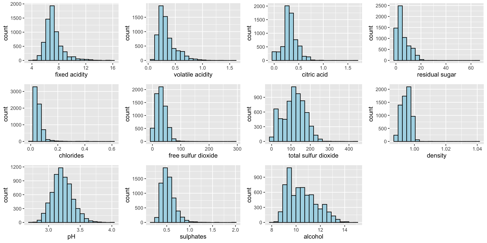

# 1.0 Overview

Correlation coefficient is a popular statistic that use to measure the type and strength of the relationship between two variables.  The values of a correlation coefficient ranges between -1.0 and 1.0.  A correlation coefficient of 1 shows a perfect linear relationship between the two variables, while a -1.0 shows a perfect inverse relationship between the two variables.  A correlation coeficient of 0.0 shows no linear relationship between the two variables. 

When multivariate data are used, the correlation coeficeints of the pair comparisons are displayed in a table form known as correlation matrix or scatterplot matrix.  

There are three broad reasons for computing a correlation matrix.

- To reveal the relationship between highdimensional variables pairwisely.
- To input into other analyses. For example, people commonly use correlation matrixes as inputs for exploratory factor analysis, confirmatory factor analysis, structural equation models, and linear regression when excluding missing values pairwise.
- As a diagnostic when checking other analyses. For example, with linear regression a high amount of correlations suggests that the linear regression’s estimates will be unreliable.

When the data is large, both in terms of the number of observations and the number of variables, [Corrgram](http://www.datavis.ca/papers/corrgram.pdf) tend to be used to visually explore and analyse the structure and the patterns of relations among variables.  It is designed based on two main schemes:

- Rendering the value of a correlation to depict its sign and magnitude, and
- Reordering the variables in a correlation matrix so that "similar" variables are positioned adjacently, facilitating perception. 

In this hands-on exercise, you will learn how to plot data visualisation for visualising correlation matrix with R.  It consists of three main sections.  First, you will learn how to create correlation matrix using [*pairs()*](https://www.rdocumentation.org/packages/graphics/versions/3.6.0/topics/pairs) of R Graphics.  Next, you will learn how to plot corrgram using **corrplot** package of R Lastly, you will learn how to create an interactive correlation matrix using plotly R.   .  


#  2.0 Installing and Launching R Packages

Before you get started, you are required:

- to start a new R project, and
- to create a new R Markdown document.

Next, you will use the code chunk below to install and launch **corrplot**,  **ggpubr**, **plotly** and **tidyverse** in RStudio.

<div class="layout-chunk" data-layout="l-body">
<div class="sourceCode"><pre><code><span class='va'>packages</span> <span class='op'>=</span> <span class='fu'><a href='https://rdrr.io/r/base/c.html'>c</a></span><span class='op'>(</span><span class='st'>'ggpubr'</span>, <span class='st'>'tidyverse'</span><span class='op'>)</span>

<span class='kw'>for</span><span class='op'>(</span><span class='va'>p</span> <span class='kw'>in</span> <span class='va'>packages</span><span class='op'>)</span><span class='op'>{</span><span class='va'>library</span>
  <span class='kw'>if</span><span class='op'>(</span><span class='op'>!</span><span class='kw'><a href='https://rdrr.io/r/base/library.html'>require</a></span><span class='op'>(</span><span class='va'>p</span>, character.only <span class='op'>=</span> <span class='cn'>T</span><span class='op'>)</span><span class='op'>)</span><span class='op'>{</span>
    <span class='fu'><a href='https://rdrr.io/r/utils/install.packages.html'>install.packages</a></span><span class='op'>(</span><span class='va'>p</span><span class='op'>)</span>
  <span class='op'>}</span>
  <span class='kw'><a href='https://rdrr.io/r/base/library.html'>library</a></span><span class='op'>(</span><span class='va'>p</span>, character.only <span class='op'>=</span> <span class='cn'>T</span><span class='op'>)</span>
<span class='op'>}</span>
</code></pre></div>

</div>


# 3.0 Importing and Preparing The Data Set 

In this hands-on exercise, the [Wine Quality Data Set](https://archive.ics.uci.edu/ml/datasets/wine+quality) of UCI Machine Learning Repository will be used.  The data set consists of 13 variables and 6497 observations.  For the purpose of this exercise, we have combined the red wine and white wine data into one data file.  It is called wine_quality and is in csv file format.  


## 3.1 Importing Data

First, let us import the data into R by using *read_csv()*  of **readr** package.  


<div class="layout-chunk" data-layout="l-body">
<div class="sourceCode"><pre><code><span class='va'>wine</span> <span class='op'>&lt;-</span> <span class='fu'>read_csv</span><span class='op'>(</span><span class='st'>"data/wine_quality.csv"</span><span class='op'>)</span>
</code></pre></div>

</div>


Notice that beside quality and type, the rest of the variables are numerical and continuous data type. 


# 4.0 Univariate EDA with Histogram

In the figure below, multiple histograms are plottted to reveal the distribution of the selected variables in the wine quality data sets.  

<div class="layout-chunk" data-layout="l-body">


</div>


The code chunks used to create the data visualisation consists of two main parts.  First, we will create the individual histograms using the code chunk below.

<div class="layout-chunk" data-layout="l-body">
<div class="sourceCode"><pre><code><span class='va'>fa</span> <span class='op'>&lt;-</span> <span class='fu'>ggplot</span><span class='op'>(</span>data<span class='op'>=</span><span class='va'>wine</span>, <span class='fu'>aes</span><span class='op'>(</span>x<span class='op'>=</span> <span class='va'>`fixed acidity`</span><span class='op'>)</span><span class='op'>)</span> <span class='op'>+</span>
  <span class='fu'>geom_histogram</span><span class='op'>(</span>bins<span class='op'>=</span><span class='fl'>20</span>, color<span class='op'>=</span><span class='st'>"black"</span>, fill<span class='op'>=</span><span class='st'>"light blue"</span><span class='op'>)</span>
<span class='va'>va</span> <span class='op'>&lt;-</span> <span class='fu'>ggplot</span><span class='op'>(</span>data<span class='op'>=</span><span class='va'>wine</span>, <span class='fu'>aes</span><span class='op'>(</span>x<span class='op'>=</span> <span class='va'>`volatile acidity`</span><span class='op'>)</span><span class='op'>)</span> <span class='op'>+</span>
  <span class='fu'>geom_histogram</span><span class='op'>(</span>bins<span class='op'>=</span><span class='fl'>20</span>, color<span class='op'>=</span><span class='st'>"black"</span>, fill<span class='op'>=</span><span class='st'>"light blue"</span><span class='op'>)</span>
<span class='va'>ca</span> <span class='op'>&lt;-</span> <span class='fu'>ggplot</span><span class='op'>(</span>data<span class='op'>=</span><span class='va'>wine</span>, <span class='fu'>aes</span><span class='op'>(</span>x<span class='op'>=</span> <span class='va'>`citric acid`</span><span class='op'>)</span><span class='op'>)</span> <span class='op'>+</span>
  <span class='fu'>geom_histogram</span><span class='op'>(</span>bins<span class='op'>=</span><span class='fl'>20</span>, color<span class='op'>=</span><span class='st'>"black"</span>, fill<span class='op'>=</span><span class='st'>"light blue"</span><span class='op'>)</span>
<span class='va'>rs</span> <span class='op'>&lt;-</span> <span class='fu'>ggplot</span><span class='op'>(</span>data<span class='op'>=</span><span class='va'>wine</span>, <span class='fu'>aes</span><span class='op'>(</span>x<span class='op'>=</span> <span class='va'>`residual sugar`</span><span class='op'>)</span><span class='op'>)</span> <span class='op'>+</span>
  <span class='fu'>geom_histogram</span><span class='op'>(</span>bins<span class='op'>=</span><span class='fl'>20</span>, color<span class='op'>=</span><span class='st'>"black"</span>, fill<span class='op'>=</span><span class='st'>"light blue"</span><span class='op'>)</span>
<span class='va'>ch</span> <span class='op'>&lt;-</span> <span class='fu'>ggplot</span><span class='op'>(</span>data<span class='op'>=</span><span class='va'>wine</span>, <span class='fu'>aes</span><span class='op'>(</span>x<span class='op'>=</span> <span class='va'>`chlorides`</span><span class='op'>)</span><span class='op'>)</span> <span class='op'>+</span>
  <span class='fu'>geom_histogram</span><span class='op'>(</span>bins<span class='op'>=</span><span class='fl'>20</span>, color<span class='op'>=</span><span class='st'>"black"</span>, fill<span class='op'>=</span><span class='st'>"light blue"</span><span class='op'>)</span>
<span class='va'>fSO2</span> <span class='op'>&lt;-</span> <span class='fu'>ggplot</span><span class='op'>(</span>data<span class='op'>=</span><span class='va'>wine</span>, <span class='fu'>aes</span><span class='op'>(</span>x<span class='op'>=</span> <span class='va'>`free sulfur dioxide`</span><span class='op'>)</span><span class='op'>)</span> <span class='op'>+</span>
  <span class='fu'>geom_histogram</span><span class='op'>(</span>bins<span class='op'>=</span><span class='fl'>20</span>, color<span class='op'>=</span><span class='st'>"black"</span>, fill<span class='op'>=</span><span class='st'>"light blue"</span><span class='op'>)</span>
<span class='va'>tSO2</span> <span class='op'>&lt;-</span> <span class='fu'>ggplot</span><span class='op'>(</span>data<span class='op'>=</span><span class='va'>wine</span>, <span class='fu'>aes</span><span class='op'>(</span>x<span class='op'>=</span> <span class='va'>`total sulfur dioxide`</span><span class='op'>)</span><span class='op'>)</span> <span class='op'>+</span>
  <span class='fu'>geom_histogram</span><span class='op'>(</span>bins<span class='op'>=</span><span class='fl'>20</span>, color<span class='op'>=</span><span class='st'>"black"</span>, fill<span class='op'>=</span><span class='st'>"light blue"</span><span class='op'>)</span>
<span class='va'>density</span> <span class='op'>&lt;-</span> <span class='fu'>ggplot</span><span class='op'>(</span>data<span class='op'>=</span><span class='va'>wine</span>, <span class='fu'>aes</span><span class='op'>(</span>x<span class='op'>=</span> <span class='va'>density</span><span class='op'>)</span><span class='op'>)</span> <span class='op'>+</span>
  <span class='fu'>geom_histogram</span><span class='op'>(</span>bins<span class='op'>=</span><span class='fl'>20</span>, color<span class='op'>=</span><span class='st'>"black"</span>, fill<span class='op'>=</span><span class='st'>"light blue"</span><span class='op'>)</span>
<span class='va'>pH</span> <span class='op'>&lt;-</span> <span class='fu'>ggplot</span><span class='op'>(</span>data<span class='op'>=</span><span class='va'>wine</span>, <span class='fu'>aes</span><span class='op'>(</span>x<span class='op'>=</span> <span class='va'>pH</span><span class='op'>)</span><span class='op'>)</span> <span class='op'>+</span>
  <span class='fu'>geom_histogram</span><span class='op'>(</span>bins<span class='op'>=</span><span class='fl'>20</span>, color<span class='op'>=</span><span class='st'>"black"</span>, fill<span class='op'>=</span><span class='st'>"light blue"</span><span class='op'>)</span>
<span class='va'>sulphates</span> <span class='op'>&lt;-</span> <span class='fu'>ggplot</span><span class='op'>(</span>data<span class='op'>=</span><span class='va'>wine</span>, <span class='fu'>aes</span><span class='op'>(</span>x<span class='op'>=</span> <span class='va'>sulphates</span><span class='op'>)</span><span class='op'>)</span> <span class='op'>+</span>
  <span class='fu'>geom_histogram</span><span class='op'>(</span>bins<span class='op'>=</span><span class='fl'>20</span>, color<span class='op'>=</span><span class='st'>"black"</span>, fill<span class='op'>=</span><span class='st'>"light blue"</span><span class='op'>)</span>
<span class='va'>alcohol</span> <span class='op'>&lt;-</span> <span class='fu'>ggplot</span><span class='op'>(</span>data<span class='op'>=</span><span class='va'>wine</span>, <span class='fu'>aes</span><span class='op'>(</span>x<span class='op'>=</span> <span class='va'>alcohol</span><span class='op'>)</span><span class='op'>)</span> <span class='op'>+</span>
  <span class='fu'>geom_histogram</span><span class='op'>(</span>bins<span class='op'>=</span><span class='fl'>20</span>, color<span class='op'>=</span><span class='st'>"black"</span>, fill<span class='op'>=</span><span class='st'>"light blue"</span><span class='op'>)</span>
</code></pre></div>

</div>


Next, the *ggarrange* function of **ggpur** package is used to group these histograms together.

<div class="layout-chunk" data-layout="l-body">
<div class="sourceCode"><pre><code><span class='fu'>ggarrange</span><span class='op'>(</span><span class='va'>fa</span>, <span class='va'>va</span>, <span class='va'>ca</span>, <span class='va'>rs</span>, <span class='va'>ch</span>, <span class='va'>fSO2</span>, <span class='va'>tSO2</span>, <span class='va'>density</span>, <span class='va'>pH</span>, <span class='va'>sulphates</span>, <span class='va'>alcohol</span>, 
          ncol <span class='op'>=</span> <span class='fl'>4</span>, nrow <span class='op'>=</span> <span class='fl'>3</span><span class='op'>)</span>
</code></pre></div>

</div>


```{.r .distill-force-highlighting-css}
```
