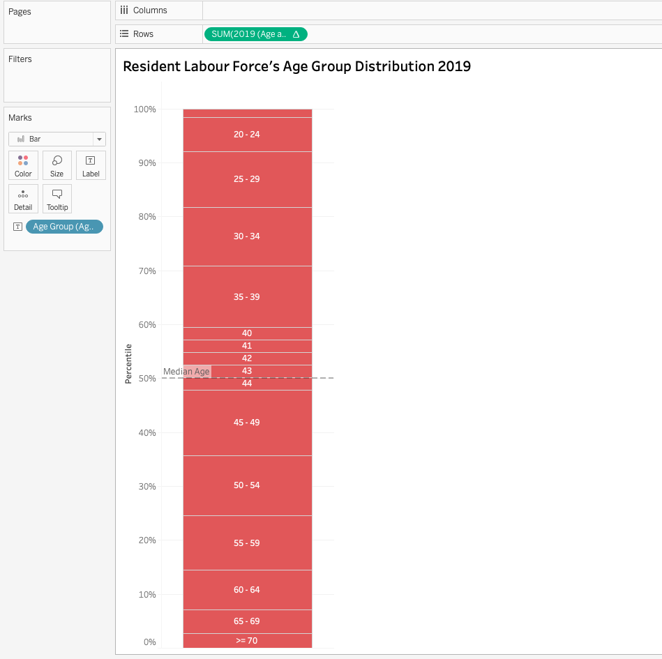

```{r setup, include=FALSE}
knitr::opts_chunk$set(echo = FALSE)

# Learn more about creating blogs with Distill at:
# https://rstudio.github.io/distill/blog.html

```

**Data Visualisation Link (Tableau Public)** - https://public.tableau.com/profile/xinyue.bai#!/vizhome/DataVizMakeover1_16118346604830/Dashboard1?publish=yes 

# **1. Critiques and Suggestions**
```{r critiques, echo=FALSE, out.width="150%"}
library(knitr)

```

```{r include=FALSE}
library(knitr)
library(dplyr)
library(kableExtra)
library(pander)
```

## **1.1 Clarity**
```{r clarity, echo=FALSE, message=FALSE, warning=FALSE}
SN <- c(" 1.", " 2.", " 3.", " 4.", " 5.")
Critique <-c("There is no y-axis on the graph. Readers can only see the trend of resident labour force percentage by age group. When they want to know the approximate values for certain age groups, they need to look up the table at the bottom, which is not very clear and efficient.",
             "The purpose of this visualisation is not conveyed well enough by the title. This visualisation aims to compare the share of resident labour force of different age groups between 2009 and 2019. The title \"resident labour force by age\" is oversimplified.",
             "It’s redundant to have the table at the bottom as it contains the same information as in the line chart. There is no need to have separate representation.",
             "In the statement, it mentions the labour force participation rate (LFPR), however in this visualisation, there is no information or visualisation about LFPR.",
             "It’s not clear and easy to see how median age is derived based on this visualisation.")
Suggestion <-c("Add y-axis and points for each age group on the graph to facilitate easy reading.", 
               "Change the title to \"Share of Resident Labour Force by Age Group, 2009 vs 2019 (June)\".",
               "Move the table information to the existing line chart, by adding text label for each point.",
               "Add a separate visualisation representing LFPR.",
               "Add a separate visualisation to show how the median age of resident labour force is derived.")
clarity <- data.frame(SN, Critique, Suggestion)
kable(clarity,type='html', align='l') %>%
  row_spec(0, color = 'white', background = 'black', align='l') %>%
  column_spec(1, width='3em') %>%
  column_spec(2, width_min='30em') %>%
  column_spec(3, width_min='20em') %>%
  row_spec(1:5, extra_css = "border-bottom: 3px solid")

```
## **1.2 Aesthetics**
```{r aesthetics, echo=FALSE, message=FALSE, warning=FALSE}
SN <- c(" 6.", " 7.", " 8.")
Critique <-c("Source and note don't align, which makes this visualisation look messy at the bottom.",
             "Not efficient use of space, with much white spaces in the top left and right segments. Legend on the line is good, but it's a bit crowded at the bottom right corner. There are many text components in that area.",
             "The grey and blue line colours are hard to distinguish.")
Suggestion <-c("Set both source and note to be left or central alignment.", 
               "Optimise use of space.",
               "Change colour of the two lines.")
aesthetic <- data.frame(SN, Critique, Suggestion)
kable(aesthetic,type='html', align='l') %>%
  # add_header_above(c("1.1Clarity"=1," "=2), bold=T, align='l') %>%
  row_spec(0, color = 'white', background = 'black', align='l') %>%
  column_spec(1, width='3em') %>%
  column_spec(2, width_min='30em') %>%
  column_spec(3, width_min='20em') %>%
  row_spec(1:3, extra_css = "border-bottom: 3px solid")
```

# **2. Proposed Design** 


# **3. Data Visualisation Step-by-Step**
## **3.1 Data Preparation**
```{r data prep, echo=FALSE, message=FALSE, warning=FALSE}
SN <- c(" 1.", "2.", "3.", "")
Actions <-c("Table 5 “Resident Labour Force Participation Rate by Age and Sex, 2009-2019 (June)” and Table 7 “Resident Labour Force Aged Fifteen Years and Over by Age and Sex, 2009-2019 (June)” are used for the visualisation.",
             "For table 5, only columns Age Group, 2009 and 2019, as well as rows 15-19, 20-24, 25-29, 30-34, 35-30, 40-44, 45-49, 50-54, 55-59, 60-64, 65-69 and 70&over are extracted. Similarly, the same data cleaning procedure was performed for table 7, as for table 5. Below is the final datasets.", 
            "In order to find the median age of resident labour force, two charts for years 2009 and 2019 were plotted respectively, as shown below. In both years, the 50th percentile falls within age group 40-44. Therefore, a new sheet in table 7 called “Age and year” was created, and the 40-44 age group was split into five values (i.e. 40,41,42,43,44). The same number of resident labour force (i.e. aged 40-44 resident labour force / 5) was assigned to each age.", "")
Screenshots <- c("", "", "","")
worksheet <- data.frame(SN, Actions, Screenshots)
kable(worksheet, format='html', align='l') %>%
  row_spec(0, color = 'white', background = 'black', align='l') %>%
  column_spec(1, width='3em') %>%
  column_spec(2, width_min='20em') %>%
  column_spec(3, width_min='30em') %>%
  row_spec(c(1,2,4),extra_css = "border-bottom: 2px solid")
```

## **3.2 Tableau Works**
## **3.2.1 Import Data**
```{r import data, echo=FALSE, message=FALSE, warning=FALSE, out.height=100}
SN <- c(" 1.", "2.", "", "")
Actions <-c("Import excel worksheets and create an extract of the data.",
             paste("Pivot the labour force participation rate data and rename the fields.", strrep("  ", 100)), "", "")
#Screenshots <- "join tables.png" %>% pander::pandoc.image.return()
Screenshots <- c("", "","", "")
worksheet <- data.frame(SN, Actions, Screenshots)
kable(worksheet, format='html', align='l') %>%
  row_spec(0, color = 'white', background = 'black', align='l') %>%
  column_spec(1, width='3em') %>%
  column_spec(2, width_min='20em') %>%
  column_spec(3, width_min='30em') %>%
  row_spec(c(1,4),extra_css = "border-bottom: 2px solid") %>%
  kable_styling(latex_options="scale_up")
pander(worksheet)
```


```{r echo=F, include=F}
temp.df = data.frame(aimage="")
temp.mat <- as.matrix(temp.df)
colnames(temp.mat) <- 1
knitr::kable(temp.mat, format="pandoc")
```

## **3.2.2 Visualisation 1**
```{r viz1, echo=FALSE, message=FALSE, warning=FALSE}
SN <- c(" 1.", "2.", "3.", "4.", "5.", "6.", "7.", "8.")
Actions <-c("Drag Age Group under T7_T worksheet to Columns.",
            "Drag Measure Names to Filters and only tick fields of 2009 and 2019.",
            "Select Line option in the Marks panel on the left",
            "Drag Measure Values to Rows and Label, also drag Measure Names to Color.", 
            "In the Measure Values section, apply Table Calculation (Percentage of Total) to both SUM(2009) and SUM(2019).", 
            "Modify the title of y-axis (right click Edit Axis) and the number format of y-axis (right click Format -> Axis -> Numbers -> Percentage).", 
            "Change the name, title and colour of the legend (right click Edit Alias, Edit Title and Edit Colors).", 
            "Modify the title of the worksheet.")
#Screenshots <- "join tables.png" %>% pander::pandoc.image.return()
Screenshots <- c("", "", "","","", "", "", "")
worksheet <- data.frame(SN, Actions, Screenshots)
kable(worksheet, format='html', align='l') %>%
  row_spec(0, color = 'white', background = 'black', align='l') %>%
  column_spec(1, width='3em') %>%
  column_spec(2, width_min='20em') %>%
  column_spec(3, width_min='30em') %>%
  row_spec(1:8, extra_css = "border-bottom: 2px solid")
```

9.  Final Look of Visualisation 1
  


## **3.2.3 Visualisation 2**
```{r viz2, echo=FALSE, message=FALSE, warning=FALSE}
SN <- c(" 1.", " 2.", " 3.", " 4.", " 5.", " 6.", "7.")
Actions <-c("Drag Age Group and Year under T5_T to Columns.",
            "Drag LFPR under T5_T to Rows.",
            "Drag Year to Color.",
            "Dray LFPR to Label.", 
            "Hide Year’s header (right click Year -> untick Show Header).", 
            "Change the color of legend.", 
            "Modify the title of the worksheet.")
#Screenshots <- "join tables.png" %>% pander::pandoc.image.return()
Screenshots <- rep("",7)
worksheet <- data.frame(SN, Actions, Screenshots)
kable(worksheet, format='html', align='l') %>%
  row_spec(0, color = 'white', background = 'black', align='l') %>%
  column_spec(1, width='3em') %>%
  column_spec(2, width_min='20em') %>%
  column_spec(3, width_min='30em') %>%
  row_spec(1:7, extra_css = "border-bottom: 2px solid")
```

8.    Final Look of Visualisation 2
  

  
## **3.2.4 Visualisation 3**
```{r viz3, echo=FALSE, message=FALSE, warning=FALSE}
SN <- c(" 1.", " 2.", " 3.", " 4.", " 5.")
Actions <-c("Drag 2009 under Age and year to Rows.",
            "Apply Quick Table Calculations (Percent of Total) on 2009.",
            "Drag Year to Color.",
            "Drag Age Group under Age and year to Label.", 
            "Add reference line on the y-axis to point out median age at the 50th percentile (right click on the y-axis -> Add Reference Line -> Value: 0.5, Constant; Label: Custom, Median Age; Line, choose the second option).")
#Screenshots <- "join tables.png" %>% pander::pandoc.image.return()
Screenshots <- c(rep("",4), c(""))
worksheet <- data.frame(SN, Actions, Screenshots)
kable(worksheet, format='html', align='l') %>%
  row_spec(0, color = 'white', background = 'black', align='l') %>%
  column_spec(1, width='3em') %>%
  column_spec(2, width_min='20em') %>%
  column_spec(3, width_min='30em') %>%
  row_spec(1:5, extra_css = "border-bottom: 2px solid")
```

6.    Final Look of Visualisation 3
  

  
## **3.2.5 Visualisation 4**
```{r viz4, echo=FALSE, message=FALSE, warning=FALSE, out.width="100%"}
SN <- c(" 1.", " 2.")
Actions <-c("Perform the same procedure as for visualisation 3, using data of 2019 under Age and year instead of 2009.",
            "Change the color of bar.")
#Screenshots <- "join tables.png" %>% pander::pandoc.image.return()
Screenshots <- c("", "")
worksheet <- data.frame(SN, Actions, Screenshots)
kable(worksheet, format='html', align='l') %>%
  row_spec(0, color = 'white', background = 'black', align='l') %>%
  column_spec(1, width='3em') %>%
  column_spec(2, width_min='20em') %>%
  column_spec(3, width_min='30em') %>%
  row_spec(1:2, extra_css = "border-bottom: 2px solid")
```

3.    Final Look of Visualisation 4
  


## **3.2.6 Dashboard**
```{r dashboard, echo=FALSE, message=FALSE, warning=FALSE}
SN <- c(" 1.")
Actions <-c("Create a dashboard to combine 4 visualisations and lay out accordingly.")
#Screenshots <- "join tables.png" %>% pander::pandoc.image.return()
Screenshots <- c("")
worksheet <- data.frame(SN, Actions, Screenshots)
kable(worksheet, format='html', align='l') %>%
  row_spec(0, color = 'white', background = 'black', align='l') %>%
  column_spec(1, width='3em') %>%
  column_spec(2, width_min='20em') %>%
  column_spec(3, width_min='30em') %>%
  row_spec(1, extra_css = "border-bottom: 2px solid")
```

# **4. Final Data Visualisation Output**


# **5. Major Observations**
1. The working population in Singapore is increasing, as for most age groups, labour force participation rate increased from 2009 to 2019. In particular, over 80% of residents aged between 25 and 54 are in the labour force.
  
2. The composition of resident labour forces in Singapore is changing. In comparison to 2009, share of resident labours aged between 15 and 54 decreased in 2019, whereas for labours aged over 55 years old, their shares in total working population increased in 2019. There are more older labours in the community. This phenomenon can be explained by the economic growth and more accessible health care facilities in Singapore.
  
3. As we can see from resident labour force' age group distribution graph, the percentage of older labours increased dramatically from 2009 to 2019. Labours aged over 45 years old was around 40% of working population in 2009, but it's approaching 50% in 2019. As a result, the median age of residents labours moved from 41 in 2009 to 44 in 2019.