```{r setup, include=FALSE}
knitr::opts_chunk$set(echo = FALSE)
```

**Data Visualisation Link (Tableau Public)** -
https://public.tableau.com/profile/xinyue.bai#!/vizhome/ofStronglyAgree-gettingCOVID/DatavizMakeover2?publish=yes 

## 1. Background Information
For this visualisation makeover, I have used data from [**Imperial College London YouGov Covid 19 Behaviour Tracker Data Hub**](https://github.com/YouGov-Data/covid-19-tracker). This data gathers global insights on people’s behaviours in response to COVID-19 covering 29 countries, in the form of survey questionnaire. 
In particular, this post is interested in exploring the willingness of the public on COVID-vaccination. In this blog, I will makeover visualisation on vaccine willingness done by one of the research scientists, by examining the following 3 survey questions in the context of different gender and employment status: \
  1.  If a Covid-19 vaccine were made available to me this week, I would definitely get it. \
  2.  I am worried about getting COVID19. \
  3.  I am worried about potential side effects of a COVID19 vaccine. \

## 2. Critiques and Suggestions
```{r critiques, echo=FALSE, out.width="150%", fig.cap="original visualisation"}
library(knitr)
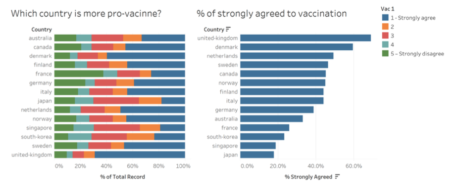
```

```{r include=FALSE}
library(dplyr)
library(kableExtra)
```

### 2.1 Clarity
```{r clarity, echo=FALSE, message=FALSE, warning=FALSE}
SN <- 1:6 #c(" 1.", " 2.", " 3.", " 4.", " 5.", "6.")
Critique <-c("Visualisation on the left is intended to show “which country is more pro-vaccine”, by computing the percentage of each response and combining them into a percentage stacked bar chart. However, for each country, it’s not easy to see the proportion of pro-vaccine and compare it among different countries.",
             "Moreover, scaling each bar into the same height is not clear enough to compare the difference between pro-vaccine responses and anti-vaccine responses.",
             "It’s hard to distinguish bars having the same length.",
             "Legend is not very clear, i.e. what does 2, 3, 4 represent specifically?",
             "Visualisation on the right is generally straightforward and clear. However, the simple percentage does not reflect statistical measures, how much you can expect your service results to reflect the view from the overall population. For example, if we have a high proportion of strongly agree responses with a wide margin of error, then this survey result is not very reliable.",
             "Moreover, this visualisation is not convincing enough in a way that only high level view of the survey results is presented and insights from different angles are not revealed. For example, by examining deeper into gender level, males are generally more willing to get vaccinated than females respondents.")
Suggestion <-c("Sort countries by proportion of pro-vaccine responses in descending order.", 
               "Place neutral responses at centre 0, negative value showing proportion of disagree responses and positive value showing proportion of agree responses.",
               "Add value label on each bar.",
               "Change 2, 3, 4 to 2 – Agree, 3 – I don’t know, 4 – Disagree respectively.",
               "Calculate confidence interval for each value to get a more comprehensive view of the survey results.",
               "Explore survey results from various perspectives, such as gender and employment status, and the relation between other survey questions.")
clarity <- data.frame(SN, Critique, Suggestion)
kable(clarity,type='html', align='l') %>%
  row_spec(0, color = 'white', background = 'black', align='l') %>%
  column_spec(1, width='3em') %>%
  column_spec(2, width_min='30em') %>%
  column_spec(3, width_min='20em') %>%
  row_spec(1:6, extra_css = "border-bottom: 1.5px solid")

```

### 2.2 Aesthetics
```{r aesthetic, echo=FALSE, message=FALSE, warning=FALSE}
SN <- 1:3
Critique <-c("It’s redundant and distractive to use five different colours for each response in the left visualisation, making it hard to view the survey results. | Use the same colour for the same group (1.agree 2.neutral 3. disagree) with different hue level. For example, dark green for strongly agree, light green for agree.",
             "The x-axis of two visualisations are not consistent, the first plot has no decimal place whereas the second plot has 2 decimal places.",
             "Generally good axis marks in twenties and grid lines to facilitate easy readings, clear use of fonts, font sizes and layout with very straightforward titles.")
Suggestion <-c("Use the same colour for the same group (1.agree 2.neutral 3. disagree) with different hue level. For example, dark green for strongly agree, light green for agree.", 
               "Make them consistent.",
               "Follow and format to ensure so.")
aesthetic <- data.frame(SN, Critique, Suggestion)
kable(aesthetic,type='html', align='l') %>%
  row_spec(0, color = 'white', background = 'black', align='l') %>%
  column_spec(1, width='3em') %>%
  column_spec(2, width_min='30em') %>%
  column_spec(3, width_min='20em') %>%
  row_spec(1:3, extra_css = "border-bottom: 1.5px solid")

```

## 3. Proposed Design
### 3.1 Sketch


### 3.2 Advantages of Proposed Design
**The first visualisation:** \
1. Clearly show which country is more pro-vaccine, by sorting rows according to % of pro-vaccine. \
2. Easier to detect difference between two types of responses and difference between countries, with postive and negative x-axis representing pro-vaccine and anti-vaccine responses respectively. \

**The second visualisation:** \
- Clearly show how reliable the result is, by applying confidence interval. \

**The third visualisation:** \
- Help audiences better understand the public willingness on Covid-19 vaccination and the potential reasons why the public agrees or disagrees to getting vaccinated, by looking into the result of survey's questions **vac2.1(worry about getting COVID)** and **vac2.2(worry about potential side effect of vaccine)**, and plotting their relation wtih trend lines. \

**Other comments:** \
- By applying tooltip, the fourth and fifth visualisation provide audiences with a more comprehensive understanding of the survey results on vaccine willingness at the country level. Similarly, being able to filter via **gender** and **employment** status gives insights on the different behaviours within each group. \

## 4. Data Visualisation Step-by-Step
### 4.1 Data Preparation
1. Import australia.csv, canada.csv, denmark.csv, finland.csv, france.csv, germany.csv, italy.csv, japan.csv, netherlands.csv, norway.csv, singapore.csv, south-korea.csv, sweden.csv, united-kingdom.csv files into tableau. \ 
2. Double click on New Union at the bottom left of Files and drag all csv files into Specific. 
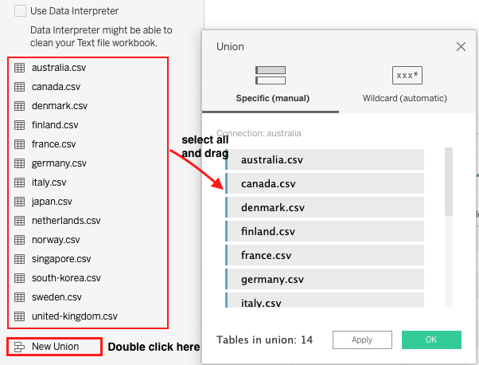
3. Click on the triangle button on the top right and custom split variable vac_1 to obtain the score value for each response category (e.g. 1 - Strongly agree -> 1).
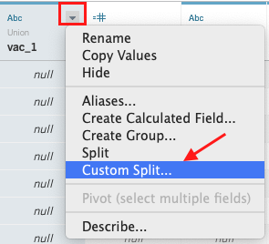
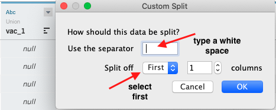
4. Edit aliases for new column created (i.e. vac_1 - Split 1), 1 -> **1 - Strongly**, 2 -> **2 - Agree**, 3 -> **3 - I don't know**, 4 -> **4 - Disagree**, 5 -> **5 - Strongly disagree**.
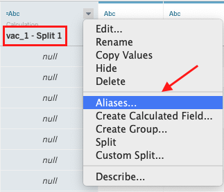
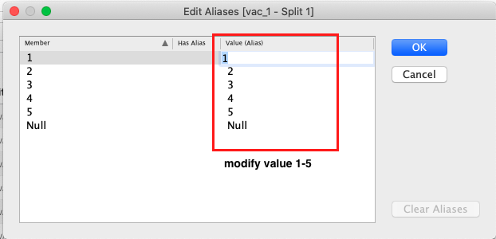
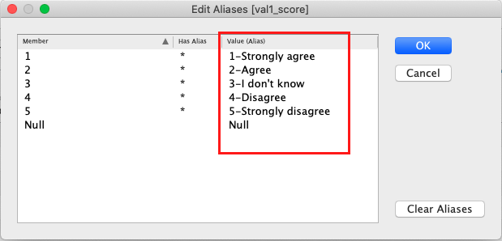
5. Rename new column as **vac1_score**.
6. Click on **"=Abc"** symbol and change its data type to **Number(whole)**.
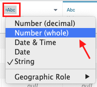
7. Rename **Table Name** as **Country**.

### 4.2 Creating Visualisation
### 4.2.1 Visualisation 1
1. Open a new worksheet. \
2. Click on **Analysis** -> **Create Calculated Field**. \
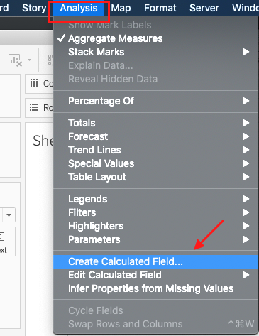
3. Create 7 calculated fields as follow: \
    -  **Number of Records - Vac1** \
    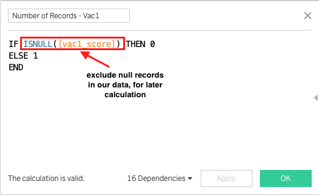
    -  **Total Records - Vac1** \
    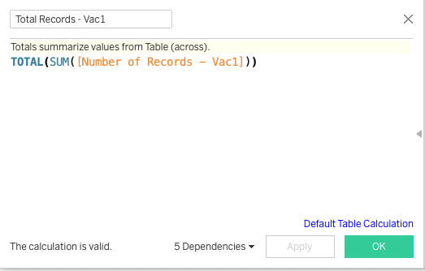
    -  **Count Negative** \
    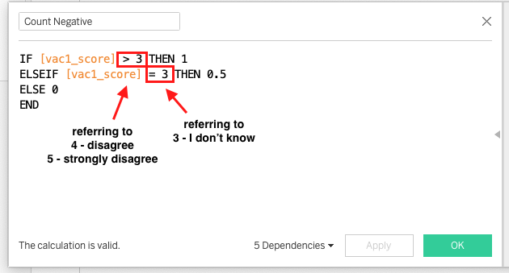
    -  **Total Count Negative** \
    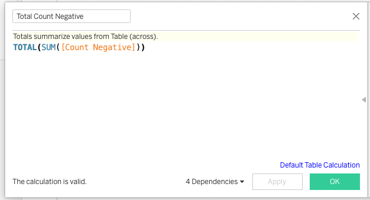
    -  **Percentage - Vac1** \
    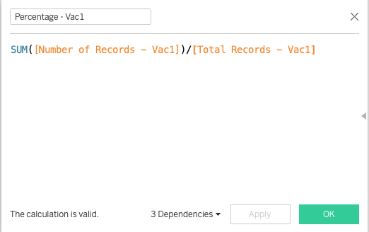
    -  **Gantt Start** \
    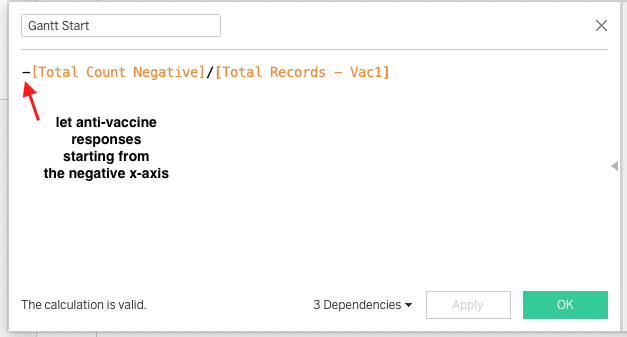
    -  **Gantt Percentage** \
    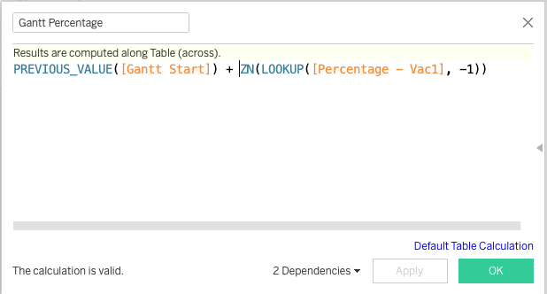
    
4. Drag **Country** to **Rows**, **Grantt Percentage** to **Columns**, **vac1_score** to **Detail** and **Color** \

5. Gantt Percentage, click on the triangle button -> Compute Using -> **vac1_score**\
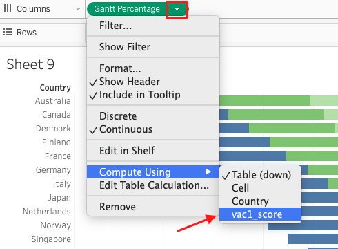
6. On the legend panel, right click on **Null**, **exclude** null records.\
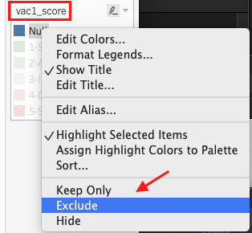
7. On the Marks panel, right click on the triangle button of **vac1_score** (either color or detail), manually sort the vac1_score, in a order of strongly disagree -> disagree -> I don't know -> agree -> strongly agree.\
-  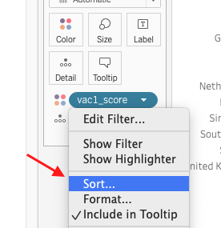{width=50%} \
-  {width=50%} \
-  Before sort: 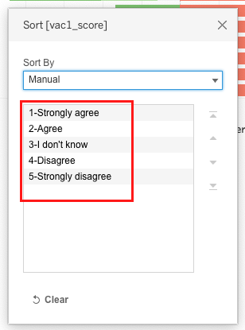{width=50%} \
-  After sort: {width=50%} \
8. Change chart type from Automatic to **Gantt Bar** \
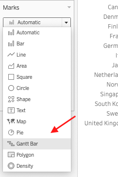
9. Drag **Percentage - Vac1** to **Size** and **Label**.\
10. Adjust label's alignment. \
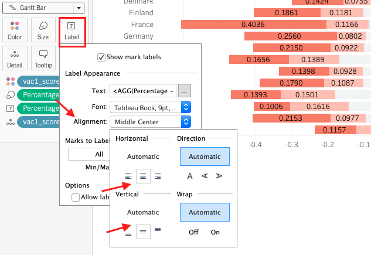

11. Change label's format from Automatic to **Percentage**.\
-  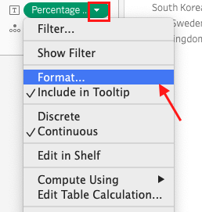
-  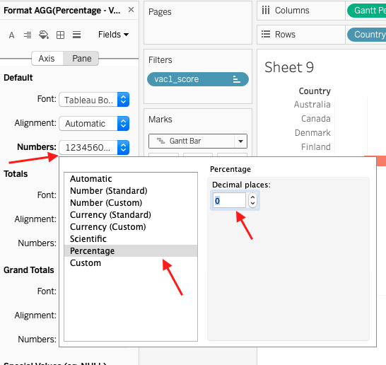
12. Similarly, right click on the x-axis and choose format, change axis's value format to **Percentage** and add tick marks.\
-  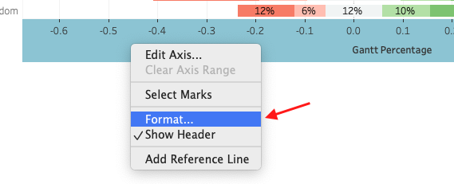 \
-  Add tick marks: 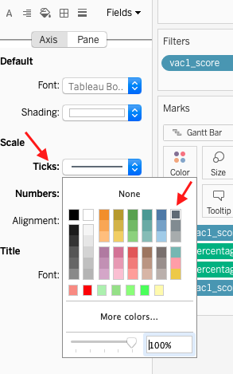
13. Change **color** of the gantt bar. What it displays here is already the color I wanted. Red color represents anti-vaccine responses and green color represents pro-vaccine responses. Also, darker color implies more extreme responses (e.g. strongly agree and strongly disagree).\
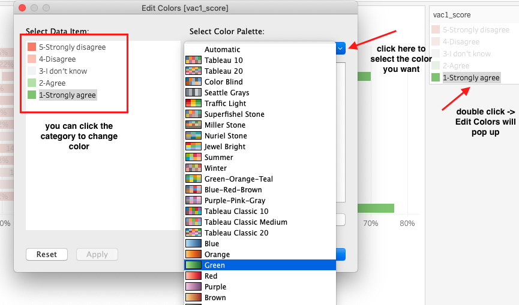{width=90%}
14. **Sort** Country by % of pro-vaccine responses.\
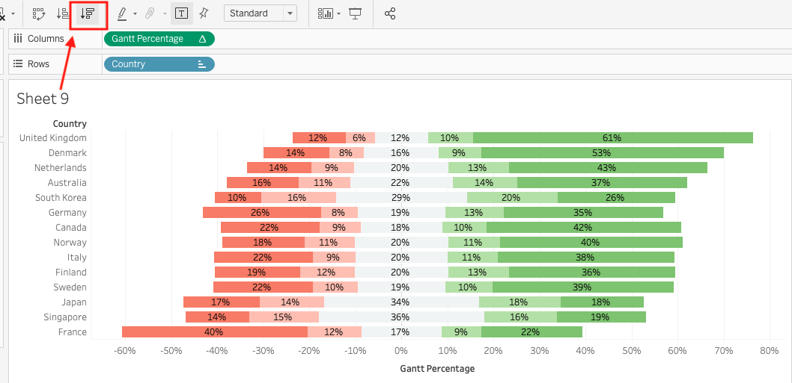{width=110%}
15. Right click on x-axis **Edit Axis**, change x-axis's range to -100% to 100% and change its **title** to % of Total. \
-  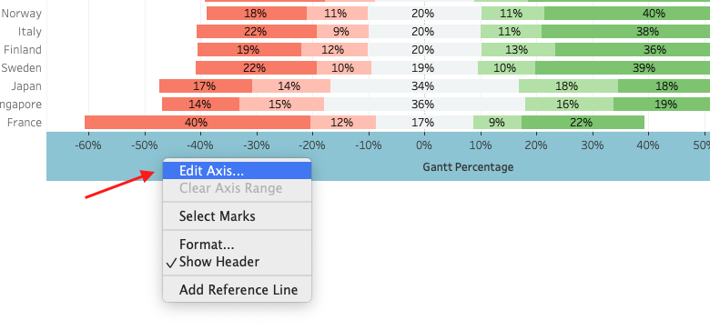\
-  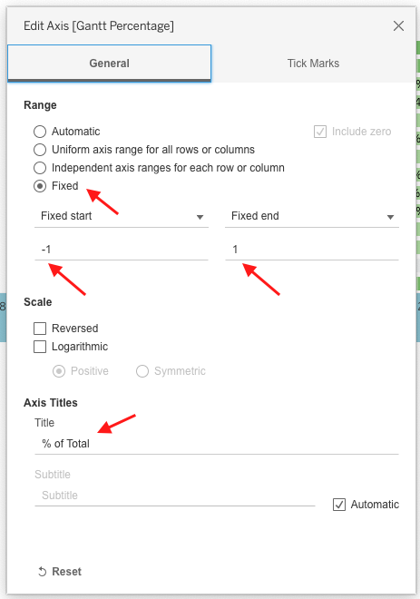
16. Drag **gender** and **employment_status** to **Filters**. \
-  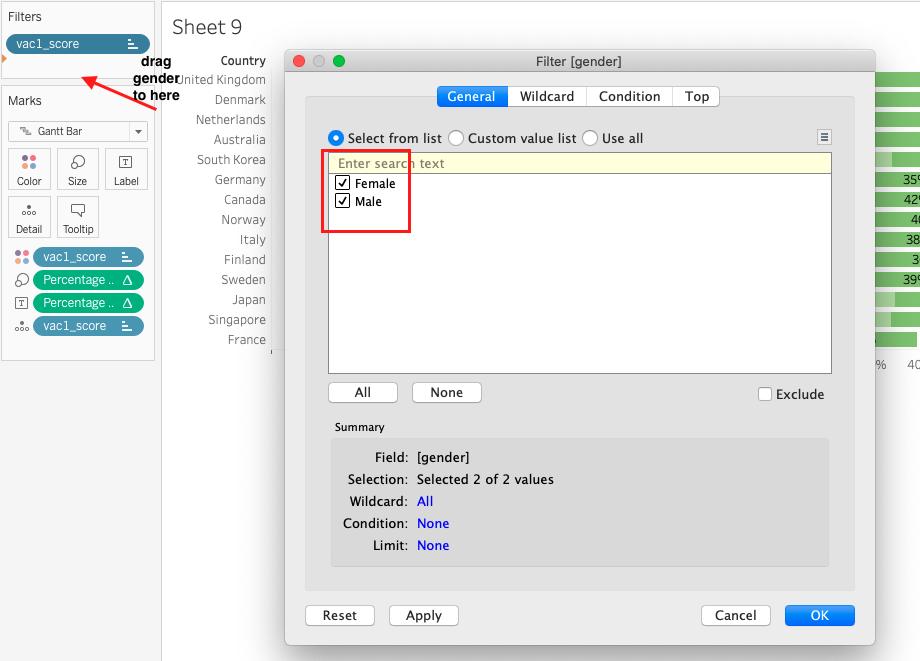{width=90%}\
-  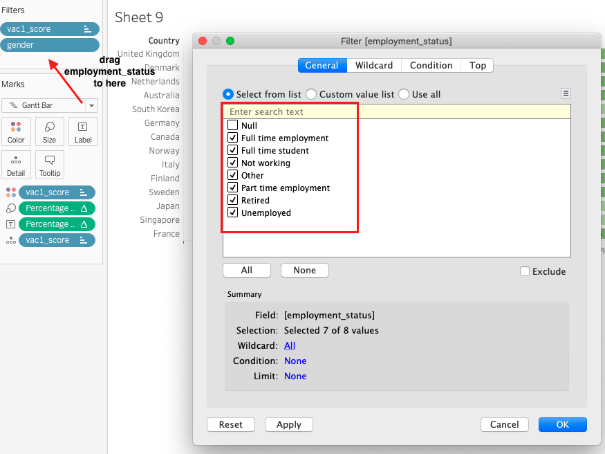{width=90%}
17. Add **pro-vaccine** and **anti-vaccine** annotation on the chart for better clarity.
-  Right click on the pane and create an **annotation box** for **pro-vaccine**.\
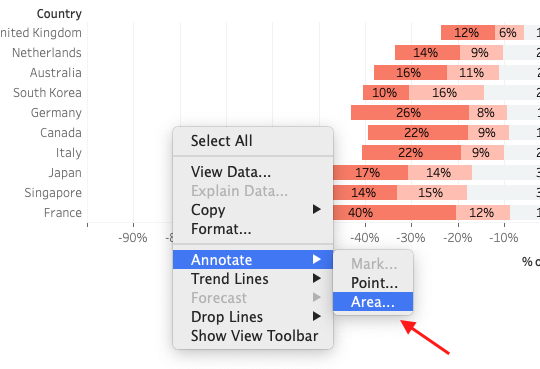\
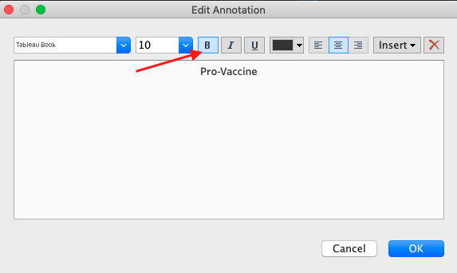\
-  Right click on the box and select format to change the background color. \ 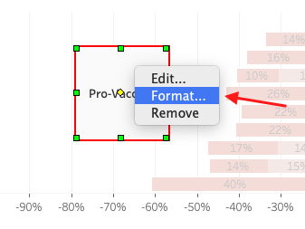\
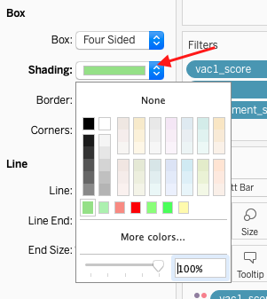\
-  Apply the same procedure for **anti-vaccine** annotation. Final look: \ 
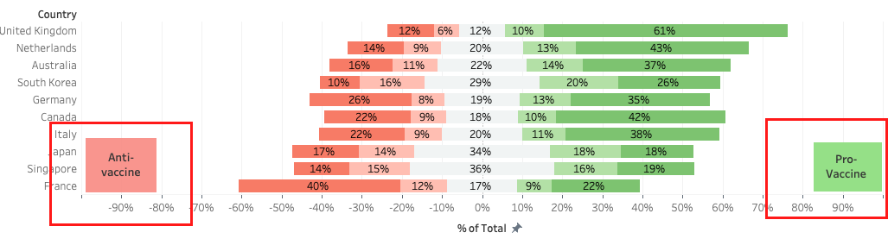{width=90%}

### 4.2.2 Visualisation 2
1. Open a new worksheet. \
2. Create 11 calculated fields as follow: \
    -  **Number of Strongly Agree - Vac1** \
    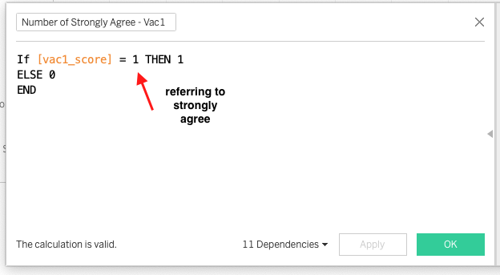
    -  **Prop of strongly agree - vac1** \
    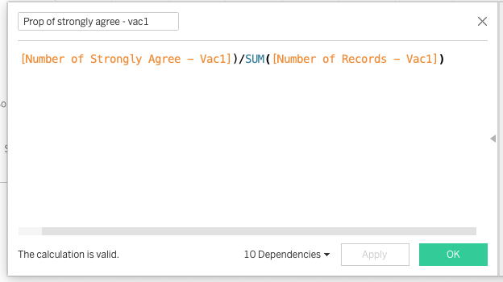
    -  **Z_95%** \
    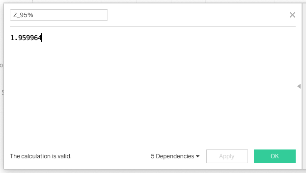
    -  **Z_99%** \
    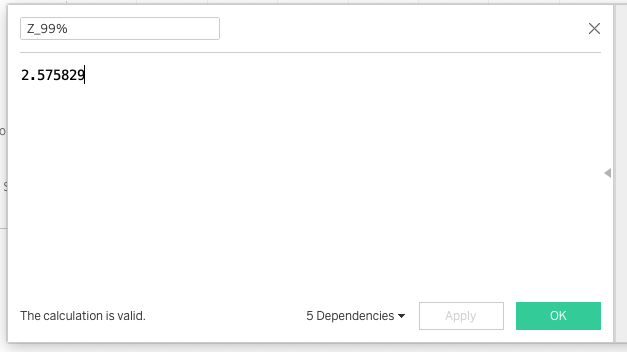
    -  **Prop-Standard Error** \
    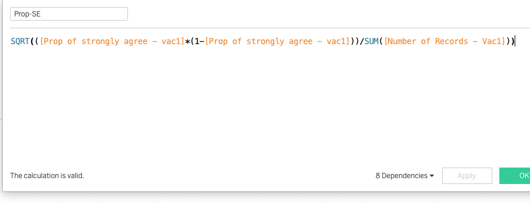{width=90%}
    -  **Prop_Margin of Error 95%** \
    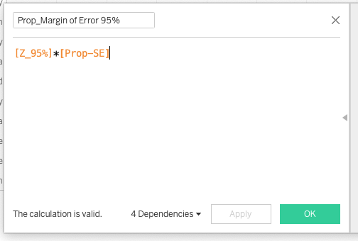
    -  **Prop_Margin of Error 99%** \
    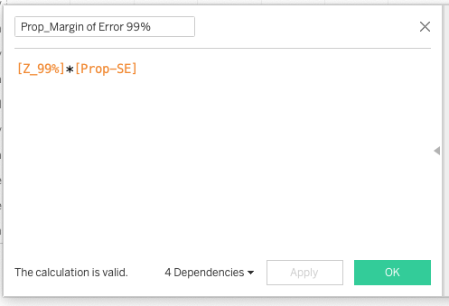
    -  **Prop_Confidence Interval 95%** \
    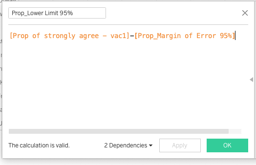 \
    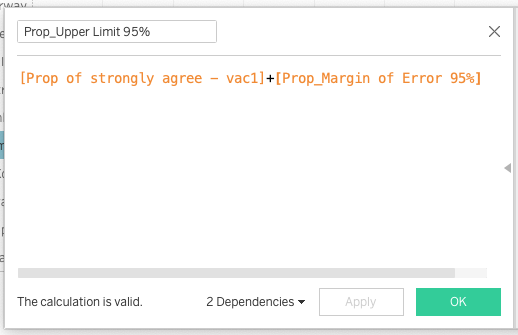
    -  **Prop_Confidence Interval 99%** \
    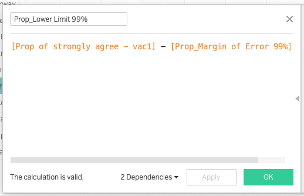 \
    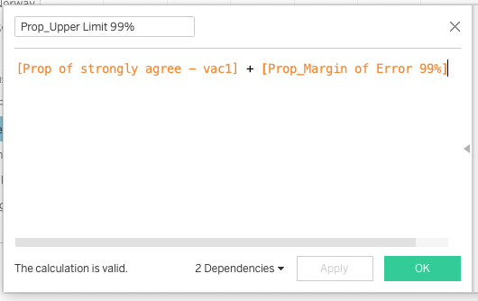
3. Drag **Country** to Rows and **Prop of strongly agree - vac1** to Columns \
4. Drag **Measure Values** to the top of x-axis. \ 
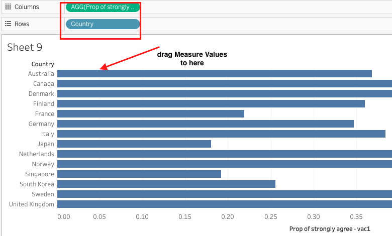
5. In the **Filters** panel, click on **Measure Names** -> **Edit Filter** -> select **95% and 99% upper and lower limits**. \
-  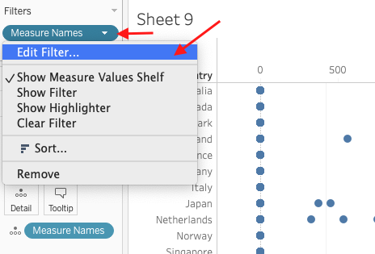 \
-   
6. Change 95% and 99% confidence interval representation to **Line**, click on the **path** and choose the last **Line Type**. \
-   \
-  
7. Drag **Measure Names** to path under **Measure Values** section. \

8. Click on **Measure Names (Detail)** under **Measure Values** section and **Prop of strongly agree - vac1** section, change it to **Color**. \
-  
9. Change columns order, put Measure Values before Prop of strongly agree - vac1 and right click on the top x-axis -> **synchronize axis**. \ 
-   \
-  
10. Change the Measure Names' order in the color legend, by adjusting in the **Measure Values** section. \
-  
\
-  
\
11. Hide the top x-axis, by unticking **Show Header**.\

12. Sort rows according to % of strongly agree. \

13. Change the color for 95% and 99% confidence interval according to your own preference, change axis's number format and add tick marks. Detailed procedures are described in the **visualisation 1**. \

### 4.2.3 Visualisation 3
1. Open a new worksheet. \
2. Create 8 calculated fields as follow: \
-  Detailed formulation can refer to visualisation 1, using Vac2.1 and Vac2.2 instead:
    -  **Number of Records - Vac2.1**, **Number of Records - Vac2.2** 
    -  **Total Records - Vac2.1**, **Total Records - Vac2.2** 
-  Detailed formulation can refer to visualisation 2, using Vac2.1 and Vac2.2 instead.
    -  **Number of Strongly agree - Vac2.1**, **Number of Strongly agree - Vac2.2**
    -  **Prop of strongly agree - vac2.1**, **Prop of strongly agree - vac2.2**
3. Drag **Prop of strongly agree - vac1** to Columns, **Prop of strongly agree - vac2.1** and **Prop of strongly agree - vac2.2** to Rows, also drag **Country** to **Detail** under **All** section. \
4. Drag **Measure Names** to **Filters** and only tick **Prop of strongly agree - vac2.1** and **Prop of strongly agree - vac2.2**. \

5. Drag **Measure Names** to **Color** under **All** section.\
6. Right click on the pane to add two trendlines.\

7. Drag **Country** to **Label** and highlist points wiht minimum % of strongly agree 2.1/2.2 and maximum % of strongly agree 2.1/2.2. \
-   \
8. Change axis's number format and add tick marks. Detailed procedures are described in the **visualisation 1**. \

### 4.2.4 Visualisation 4
1. Open a new worksheet. \
2. Drag **Country** to Rows and **Prop of strongly agree - vac2.1** to Columns, drag another **Prop of strongly agree - vac2.1** to the top of x-axis and **synchronize axis**. \

3. Change one of the variable representation to **Bar**. \

4. Adjust size and color of **Bar** and **Circle**.\
 \
 
5. Drag **Country** to **Label** under **Prop of strongly agree - vac2.1 (Circle)** section and click on Label to just its **Alignment**. \
 
6. Change the label format to **Percentage**. \
-  
7. Sort rows according to % of strongly agree - vac2.1, change axis's number format and range, add tick marks. Detailed procedures are described in the **visualisation 1**. \
8. Final look of **visualisation 4**. \ 
{width=95%}

### 4.2.5 Visualisation 5
Same procedure as visualisation 4, except using **Prop of strongly agree - vac2.2** instead of **Prop of strongly agree - vac2.1**.

### 4.2.6 Visualisation 6
1. Open a new worksheet. \
2. Drag **employment_status** to Columns, and two **vac1_score** to Rows, modify both of them to measure **Count**. \

3. Right click on the bottom y axis to make the plot into dual axis. \

4. Exclude Null employment status. \
5. Change one of the **vac1_score** representation to **Line**. \

6. Drag **vac1_score** to **Label** under the **circle** representation and modify it into **count**. \

7. Apply **Quick Table Calculation - Percent of Total** to all three **CNT(vac1_score)**. \

8. Keep only one y-axis, change the name of y-axis. Detailed procedures are described in the previous visualisation. \
9. Final look of **visualisation 6**. \


### 4.2.7 Visualisation 7
Same procedure as visualisation 4, except using **gender** instead of **employment_status**.

### Add Tooltip on Visualisation 1 & 2
1. In the visualisation 1, click **Tooltip** under the **Marks**, select the sheets you want to add. \
-   \
-  Select the sheets wanted: \
{width=95%} \
 \
-  Final look: \
 

2. In the visualisation 2, click **Tooltip** under the **Prop of strongly agree - vac1** section, modify the tooltip according to your needs. \
-   \
-  Final Tooltip: \


### 4.3 Creating Dashboard
1. Drag sheets you want to present into the canvas. \
{width=95%}
2. Add title and subtitles (using **Text** object). \
-  {width=95%} \
-  {width=95%}
3. Change subtitles' background color. \
{width=95%}
4. Add filters **Gender** & **Employment Status** to the dashboard. \

5. Chnage filters' form of representation. \

6. Use **Blank** to adjust dashboard's presentation. \
{width=95%}
7. Final look: \
{width=95%}

## 5. Major Observations
 \


1. UK respondents showed the highest willingess to get vaccinated, regardless of female or male. This is consistent with the result of question Vac2.2 with respect to potential side effect. As shown in the relationship chart, UK respondents are also least worried about the side effect of COVID vaccine. \
2. Males are generally more pro-vaccine than Females.\
\
 
3. Japan's result is very interesting. Japanese respondents show low willingess in getting vaccine overall, but they also express the highest worries of getting COVID compared to other countries. 38% of Japanese respondents worry about getting COVID whereas less than 38%, 35% of respondents worry about the potential side effects of COVID vaccine, implying getting COVID is more of their concern. \
\

4. The survey results is overall reliable, with a narrow confidence interval for all countries. Netherlands has a relatively larger CI range, but it's acceptable. \

```{r ob, echo=FALSE, out.width="50%"}


```

5. By looking into the results of more developed economies in Asia, Japan, Singapore and South korea, we can see that full-time employed respondents are more willing to get vaccination in all three countries, compared to other employment status. \
\
{witdth=30%} \
6. French respondents show the least interest in getting vaccinated, which could possibly be explained by the fear of potential side effect of COVID vaccine as almost half of respondents(44%) strongly worry about the side effect.