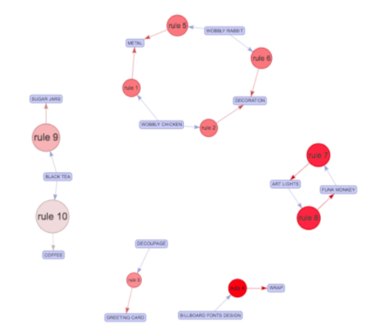

```{r setup, include=FALSE}
knitr::opts_chunk$set(echo = FALSE)
```

# 1. Introduction and Motivation

Data visualization is the graphical representation of information and data. It has been an important factor in data analytics pipeline, to reveal insights that are often difficult to be delivered in other forms. It is commonly used in various scenarios, such as data cleaning, exploring data structure, detecting pattern, identifying trends and clusters. It helps operations and management make informative decisions. Understanding the current state of data visualization is crucial. It gives organizations and practitioners in the field a better idea of where data visualization stands today, and where it’s headed.  

Collected and organized by Data Visualization Society, Annual Data visualization Community Survey includes 50+ data visualization related questions and covers data visualization details such as salary, tool use, demographic data, audiences and organizational structure. By analyzing the survey results, it can help organizations know who the data visualization professionals are and how they work. On the other hand, it helps people who have an interest in data visualization know how to enter the field.    

 

# 2.Objectives 

In this research study, we will build a R Shiny application to illustrate the current state of data visualization. The goal is to draw a comprehensive picture of data visualization for organizations, practitioners and people having an interest in data visualization, by analyzing Annual Data visualization Community Survey.  

The analysis and visualization consist of three parts: exploratory data analysis, respondents clustering and association analysis.  

-  The exploratory data analysis aims to summarize the main characteristics of the measures and generate statistical graphics to visualize them.  

-  The clustering aims to perform clustering analysis to discover similarities in respondents. 

-  To provide DataViz practitioners a guidance what are the commonly used combination of tools.  

# 3. About the Data 

The Annual Data Visualization Community Survey 2019 will be used for this project. This dataset includes responses from 1350 people. We classify the dataset into 5 different categories, challenges people face, demographics data, job-related, learning-related and tool-related questions. Below is a snippet of our dataset. Data source can be found from: https://github.com/data-visualization-society/data_visualization_survey.  

```{r 1, echo=FALSE, out.width="150%", fig.cap="Survey content and category"}
library(knitr)

```
 

# 4. Methodology, approach and visualization 

### 4.1 EDA 

In statistics, exploratory data analysis is an approach to analyzing data sets to summarize their main characteristics. We are going to use statistical graphics to visualize the results of EDA.  

Broadly, the questions will be categorized by field of topic. Five fields of topic could be recognized/ identified -- Job, learning, demography and tool and challenge.  

For the demography part, gender, education background, major and country lived of the data visualization professionals will be checked for distribution. Bar charts will be used here. 

```{r 2, echo=FALSE, out.width="150%", fig.cap="Bar chart"}
library(knitr)

``` 

For the learning part, the proportion of each learning methods can be detected. Pie charts will be used here. 

```{r 3, echo=FALSE, out.width="100%", fig.cap="Donut chart"}
library(knitr)

``` 

For the Job part, we can compare the proportion of each stage of data visualisation take part in a professional data visualization work. We can also check how many organizations have a data visualization team, how many data visualization professionals are hired to do data visualization only and what are the business areas data visualization supports. Pie charts will be used here. 

For the tool part, the proportion of the technologies used to visualize data and the method used to present data visualization could be observed. Scatter plots with error bars will be used here to display the popularity of each kind of data visualisation technology and data visualization presentation methods. We can also break down the analysis using variables from the three fields above using a variable selection parameter and focus on measure value we are look at only. 

 
```{r 4, echo=FALSE, out.width="100%", fig.cap="Dot chart with error bar"}
library(knitr)

``` 

For the challenge part, the willingness of the data visualization professionals to keep improving their data visualisation skills and the area of priority to improve their data visualization skills could be investigated. Proportion of the levels of willingness and the areas for improvement could be examined. Scatter plots with error bars will be used here to present the probability of each level of willingness and area for improvement and projected the sample probability to the population one with a confidence interval. We can also break down the analysis using variables from the three fields above using a variable selection parameter and focus on measure value we are look at only. 

### 4.2 Respondents clustering:  

For this dataset, we aim to perform clustering analysis to discover similarities in respondents. We classify the respondents based on their roles in the company, usage of visualization tools and purpose of making data visualization. We will use unsupervised clustering algorithm, latent class analysis (LCA), to show the relationship between respondents. LCA offers a way to uncover hidden groupings (latent classes) in multivariate categorical data, by applying maximum likelihood method to calculate the probability that a case will fall in a particular latent class.  

```{r 5, echo=FALSE, out.width="100%", fig.cap="Latent class analysis example"}
library(knitr)

``` 

Alternatively, we can use dendrogram to show the hierarchical relationship between objects. Dendrogram starts with each object as a separate cluster, and joins the two most similar clusters to form a single compound cluster at each step. By examining the heights of the dendrogram, the similarity between the clusters and the order in which the clusters are joined can be derived.  

```{r 6, echo=FALSE, out.width="100%", fig.cap="Dendrogram example"}
library(knitr)

``` 

### 4.3 Association rule mining 


Association Rule Mining is unsupervised machine learning method used to find an association between different objects in a set, and frequent patterns in a database. We will apply this technique to analyze association, e.g. data visualization software being used by professionals together.  This allows data visualization professionals to consider associative tools and service providers to cross-selling associative products.  

Commonly used terminology in association include itemset, support, confidence, lift. Here, I will illustrate with below small size example.  

```{r 7, echo=FALSE, out.width="100%", fig.cap="Sample data to explain association rule mining"}
library(knitr)

``` 

Below is the definition of 3 key terminologies and illustration of calculation using above sample.  

```{r 8, echo=FALSE, out.width="100%", fig.cap="Association rule mining terminology"}
library(knitr)

``` 

APRIORI algorithm is used for association rule mining. It starts with frequent itemset generation and find all frequent item-sets satisfy pre-determined min-support count threshold. List all association rules from frequent item-sets. Calculate support and confidence for all rules and keep rules that satisfy min_support and min_confidence count. For each rule, we can use lift to examine the correlation of itemset A and itemset B.  

In this part, we aim to present the confidence vs support situation for all rules like figure 1, and also allow users to select a specific rule or rules and present the details of rules.  

```{r 9, echo=FALSE, out.width="100%", fig.cap="Confidence vs support for all rules "}

``` 


```{r 10, echo=FALSE, out.width="100%", fig.cap="Display rules with itemset"}

``` 

# 5. Proposed R packages:  

```{r 11, echo=FALSE, out.width="100%", fig.cap="Proposed R packages"}

``` 

# 6. Project timeline 

```{r 12, echo=FALSE, out.width="100%", fig.cap="Project Gantt chart"}

``` 

 