```{r setup, include=FALSE}
knitr::opts_chunk$set(echo = FALSE)
```

**Data Visualisation Link (Tableau Public)** -
https://public.tableau.com/profile/xinyue.bai#!/vizhome/dataviz_16162565365570/South-eastAsiaArmedConflictAnalysis?publish=yes

## 1. Background Information
For this visualisation makeover, I have used data from [**ACLED**](https://acleddata.com/about-acled/). ACLED focuses on tracking a range of violent and non-violent actions by political agents, including governments, rebels, militias, identity groups, political parties, external actors, rioters, protesters and civilians. Data collected is used regularly to study trends in political violence and protest around the world. In particular, this post is interested in exploring the spatio-temporal patterns of armed conflict in selected South-east Asia countries, including Cambodia, Indonesia, Laos, Malaysia, Myanmar, Philippines, Thailand and Vietnam, between 2015 and 2020. \
In this blog, I will makeover visualisation on South-east Asia Armed Conflict provided by Prof.Kam, by looking into the following questions: 

-  Where did the event take place?
-  When did the event take place?
-  Who was involved?
-  What was the number of fatalities of the event?

## 2. Critiques and Suggestions
```{r critiques, echo=FALSE, out.width="150%", fig.cap="original visualisation"}
library(knitr)
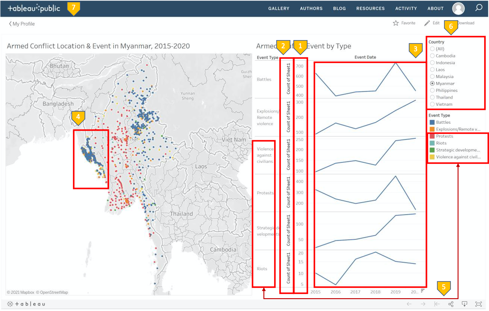
```

```{r include=FALSE}
library(dplyr)
library(kableExtra)
```

### 2.1 Clarity
```{r clarity, echo=FALSE, message=FALSE, warning=FALSE}
SN <- 1:3 
Critique <-c("Y-axis of the line chart does not start at 0, making it hard to compare between event types.",
             "Also, the name of y-axis “Count of Sheet1” is unclear.",
             "It’s redundant and hard to compare having 6 separate line graphs.")
Suggestion <-c("Make y-axis start at 0 and make it consistent across all event types.", 
               "Label the y-axis as “Count of Event Type”.",
               "Combine 6 graphs into 1 graph and use different colours to represent event types.")
clarity <- data.frame(SN, Critique, Suggestion)
kable(clarity,type='html', align='l') %>%
  row_spec(0, color = 'white', background = 'black', align='l') %>%
  column_spec(1, width='3em') %>%
  column_spec(2, width_min='20em') %>%
  column_spec(3, width_min='25em') %>%
  row_spec(SN, extra_css = "border-bottom: 1.5px solid")

```

### 2.2 Aesthetics
```{r aesthetic, echo=FALSE, message=FALSE, warning=FALSE}
SN <- c(4, 5)
Critique <-c("Points on the map are overlapping. It’s hard to distinguish the event type at each area.",
             "Order of the event type on the line chart is not aligned with the colour legend.")
Suggestion <-c("Apart from a map of events’ exact location, we can have another map to summarise information of events: \n
- Display events in a state/province level instead of precise location.
- Use unclassified choropleth map to demonstrate the event density in each state/province. 
- Use pie chart to show the distribution of event type in the tooltip.", 
"- Make order of the line chart align with the colour legend. \n - Match the line colour with the colour legend.")
aesthetic <- data.frame(SN, Critique, Suggestion)
kable(aesthetic,type='html', align='l') %>%
  row_spec(0, color = 'white', background = 'black', align='l') %>%
  column_spec(1, width='3em') %>%
  column_spec(2, width_min='20em') %>%
  column_spec(3, width_min='25em') %>%
  row_spec(1:2, extra_css = "border-bottom: 1.5px solid")

```

### 2.3 Interactivity
```{r interactivity, echo=FALSE, message=FALSE, warning=FALSE}
SN <- c(6, 7)
Critique <-c("Interaction techniques used in this visualisation are highlighting(event type) and filtering(country), allowing audiences to see the exact location of all events between 2010 - 2015 and the total counts of each event type over the years for every South-East Asia country. However, the interactivity is very limited. For example, what if audiences want to know the location of events in a specific year, as it might be different every year?",
             "Since only two techniques are used in this case, there are other type of interactivity can be applied to get a more comprehensive understanding of the data.")
Suggestion <-c("We can add more filtering options, such as year, range of dates and event type.", 
"For example, “Overview first, then details-on-demand” from Shneiderman’s mantra, we can provide a map with an overview of the event frequency with respect to state/region and a pie chart for each state on detailed distribution of event type in the tooltip. Similarly, for each event location, we can include names of two conflict groups (Actor 1 & Actor 2) in the tooltip.")
aesthetic <- data.frame(SN, Critique, Suggestion)
kable(aesthetic,type='html', align='l') %>%
  row_spec(0, color = 'white', background = 'black', align='l') %>%
  column_spec(1, width='3em') %>%
  column_spec(2, width_min='25em') %>%
  column_spec(3, width_min='20em') %>%
  row_spec(1:2, extra_css = "border-bottom: 1.5px solid")

```

## 3. Proposed Design
### 3.1 Sketch
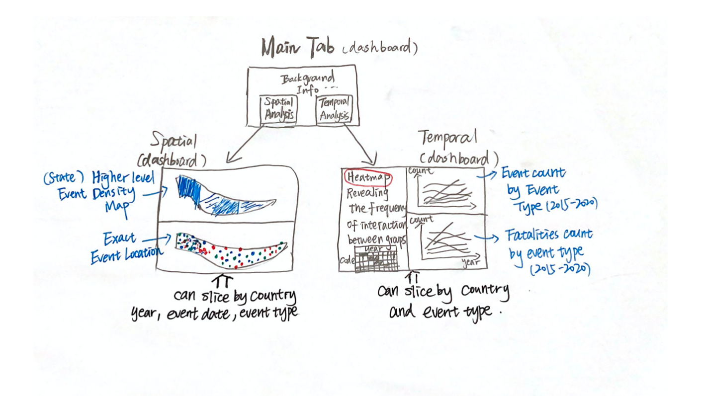

### 3.2 Advantages of Proposed Design

1.  Proposed design allows more filtering options (e.g. year, range of event date, event type).
2.  Proposed line graph is more succinct and easier to compare between event types (6 lines in one plot). Also, adding information of fatalities offers audiences a better understanding of the severity of events.
3.  Proposed state-level density map offers a more comprehensive view of the data, by showing frequency and distribution of events. 
4.  Proposed heatmap of event frequency between different groups allows audiences to know which two parties are frequently involved in an armed conflict. This information is very useful in preventing or mitigating future conflicts.

## 4. Data Visualisation Step-by-Step
### 4.1 Data Preparation

1.  Import Southeast-Asia_2010-2020_Oct31.xlsx file into tableau.
2.  Change the data type of **Year** to **Date**.
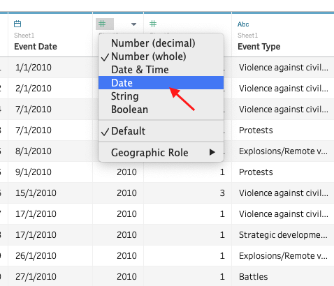

2.  Select data between **2015** and **2020**, by clicking **Filters - Add** from the top right-hand corner.

-  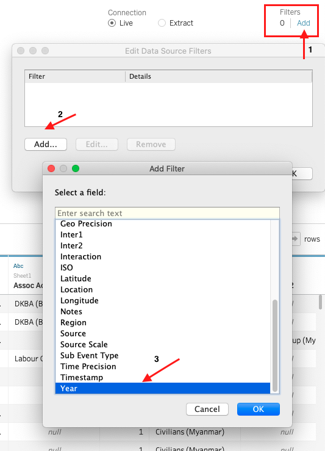
-  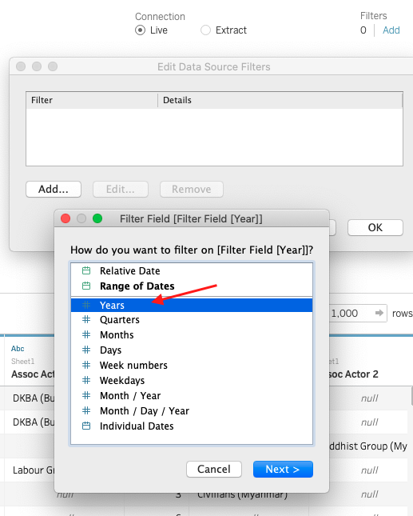
-  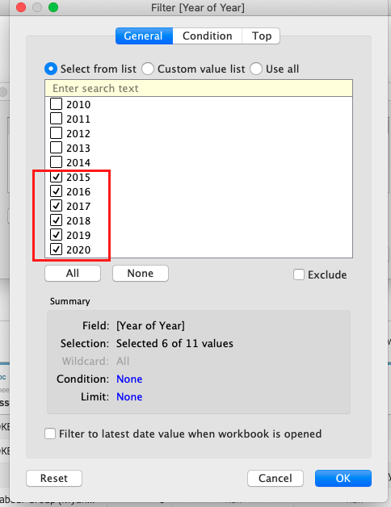
-  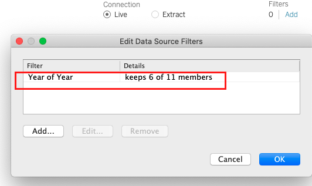

3. Change the data type of **Admin1** to **Geographic Role -> State/Province**.\
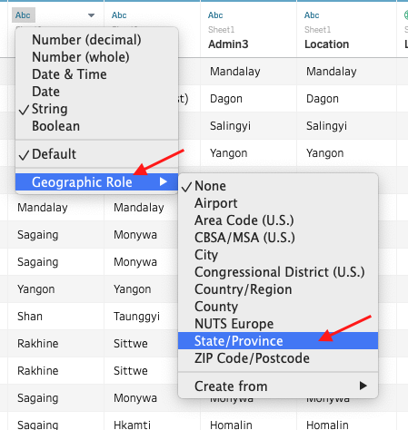
4. Similarly, change the data type of **Interaction** to **String**.

### 4.2 Creating Visualisation
### 4.2.1 Spatial Analysis Dashboard

1.  Open a new worksheet *(to create an event density map)*.
2.  Double click on **Admin1** and drag **Country** to **Detail**.
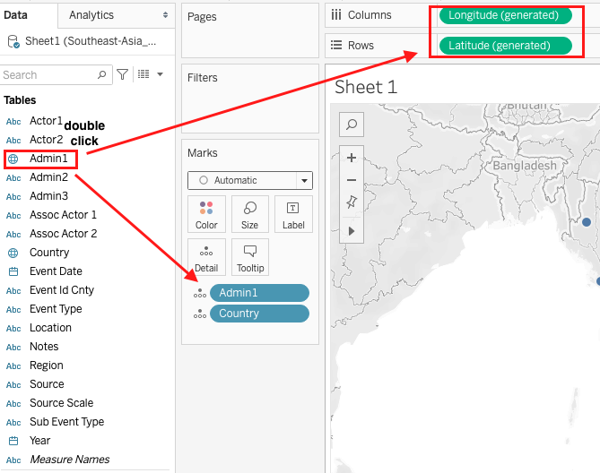
3.  Change graph representation from Automatic to **Map** under **Marks**.
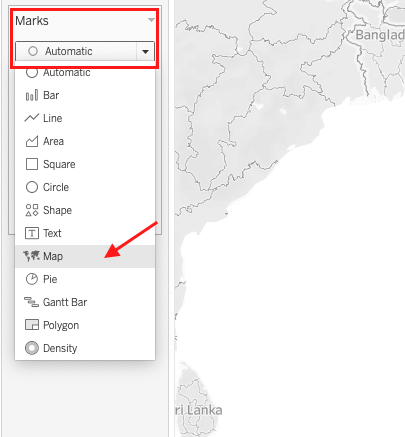
4.  Drag **Event Type** to **Color** and apply **Measure** -> **count**, to get total count of events for each state. \
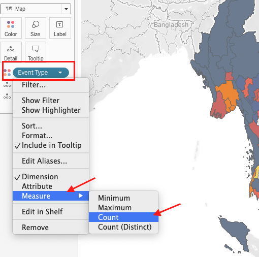
5.  Drag **Country**, **Event Type**, **Event Date**, **Year** to **Filters** and click **Show Filter**.

-  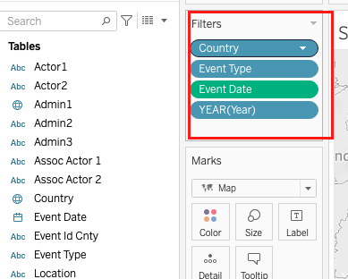
-  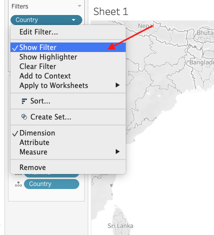

6.  Change the color palatte to Red.
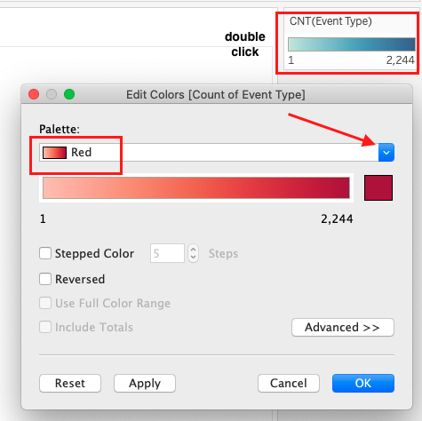
7.  Change the style of map from Light to **Normal** (Map -> Map Layer -> Style -> Normal).

-  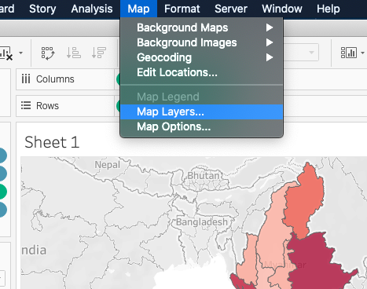
-  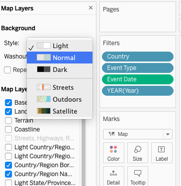

8.  Open another new worksheet *(to create a pie chart of event distribution)*.
9.  Drag **Admin1**, **Country** to **Detail**, **Event Type** to **Color**, and change graph representation from Automatic to **Pie** under **Marks**.
10.  Drag **Event Type** to **Angle**, applying **Measure** -> **count** (shown in step 4), **Quick Table Calculation** -> **Percent of Total** and **Compute Using** -> **Event Type**.

-  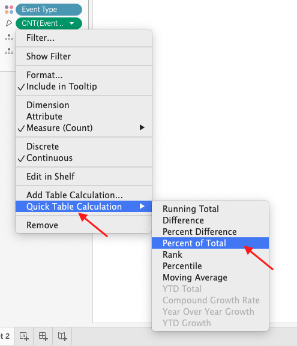
-  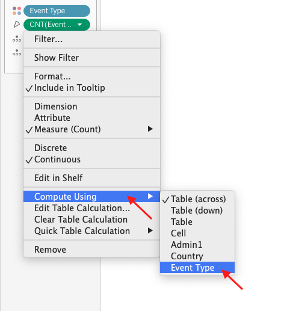

11.  Similarly, drag **Event Type** to **Label** and apply the same procedure as in step 10. Final look of the pie chart: \
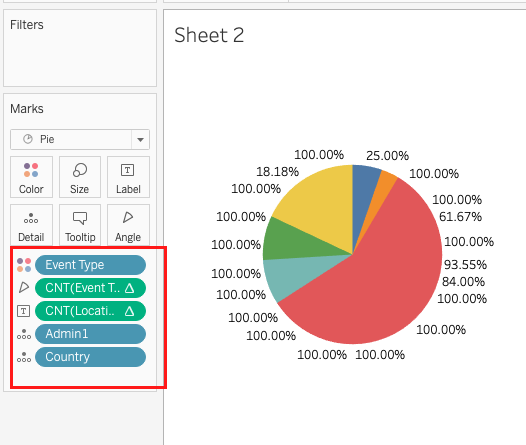

12.  Include the pie chart in the **Tooltip** of state-level event density map.
-  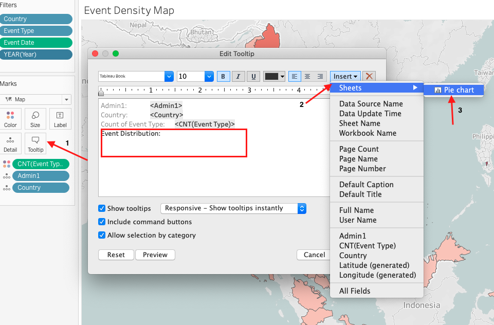
-  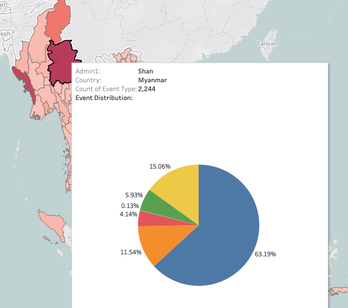

13.  Open another new worksheet *(to create a map of event exact location)*.
14.  Drag **Longitude** and **Latitude** to Columns and Rows respectively, and change both variables from **Measure(Average)** to **Dimension**. \
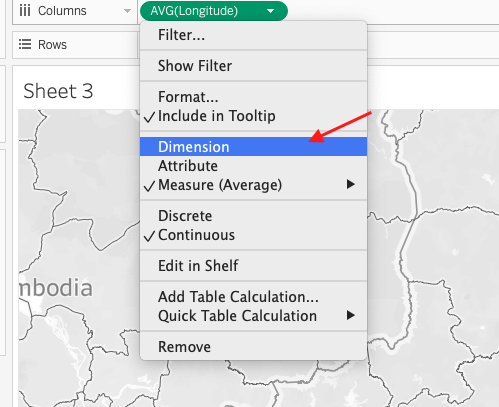
15.  Change graph representation from Automatic to **Shape** under **Marks** and drag **Event Type** to **Color** and **Shape**, adjust the size.
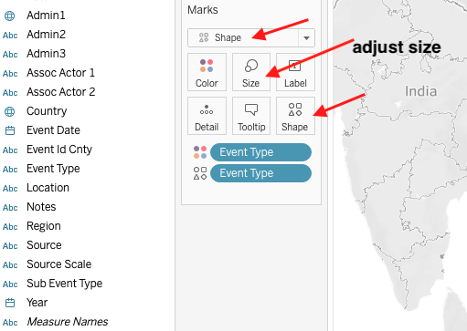

16.  Drag **Actor1**, **Actor2**, **Interaction** to **Detail** and change **Interaction** from **Measure(Count)** to **Dimension** (as shown in step 14), allowing audiences to know which party is involved in each conflict, by 
hovering over the points.\
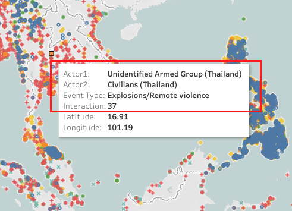
17.  Change the style of map from Light to **Normal** (as shown in step 7).
18.  Open a new dashboard.
19.  Change the size of dashboard to **Generic Desktop**.
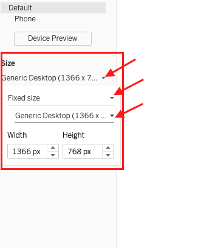
20.  Drag 2 maps into dashboard and change representation of all filters excpet **Event Date** to **Single Value (Dropdown)**. \
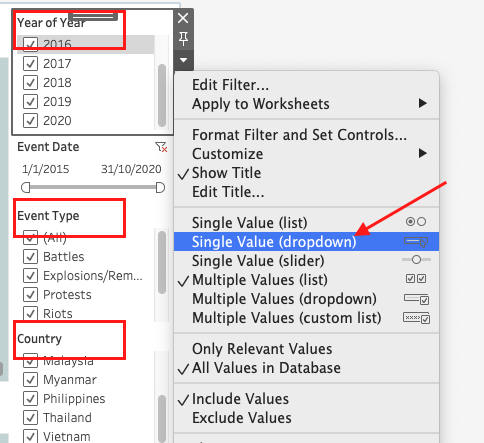
21.  Apply all filters on 2 maps, by adjusting **Applying to Worksheets** -> **Selected Worksheets**.

-  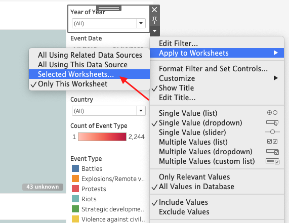
-  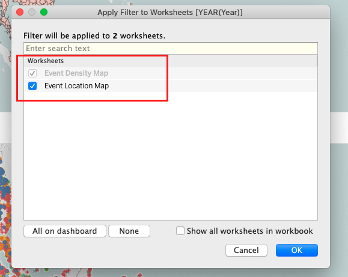

22.  Edit title of 2 maps.
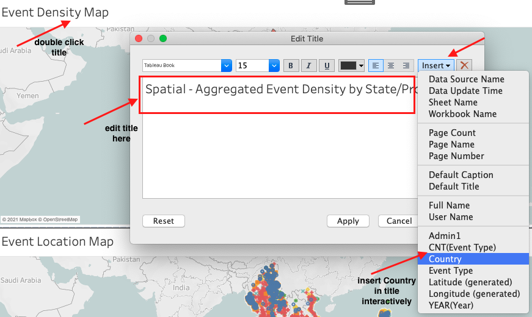
23.  Edit unknown locations, by googling online.

-  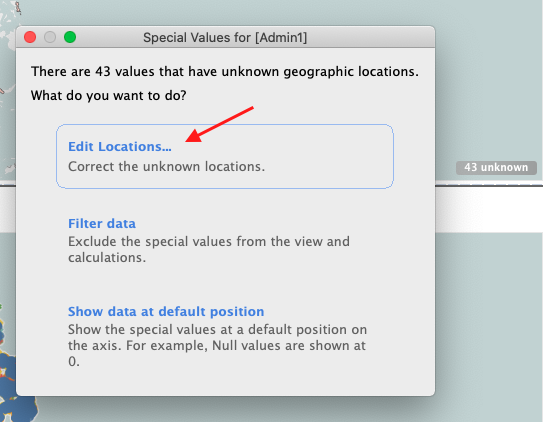
-  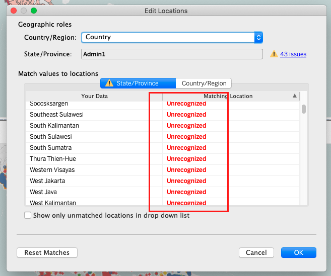

24.  Final look of **Spatial Analysis Dashboard**.
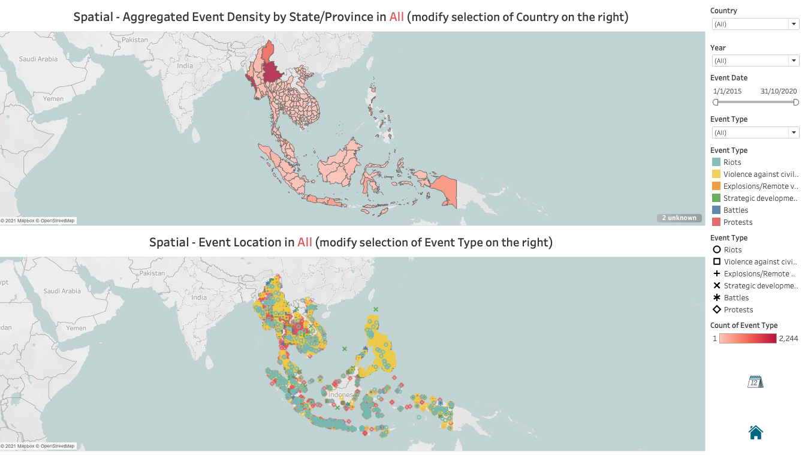{width=110%}

### 4.2.2 Temporal Analysis Dashboard
1.  Open a new worksheet *(to create a line graph showing frequency of each event type over years)*.
2.  Drag **Year** and **Event Type** to Columns and Rows respectively, and change **Event Type** from **Dimension** to **Measure(Count)** (as shown in 4.2.1. step 14).
3.  Drag **Event Type** to **Color**. 
4.  Drag **Country**, **Event Date**, **Event Type** to **Filters** and click **Show Filter**. Final look: \
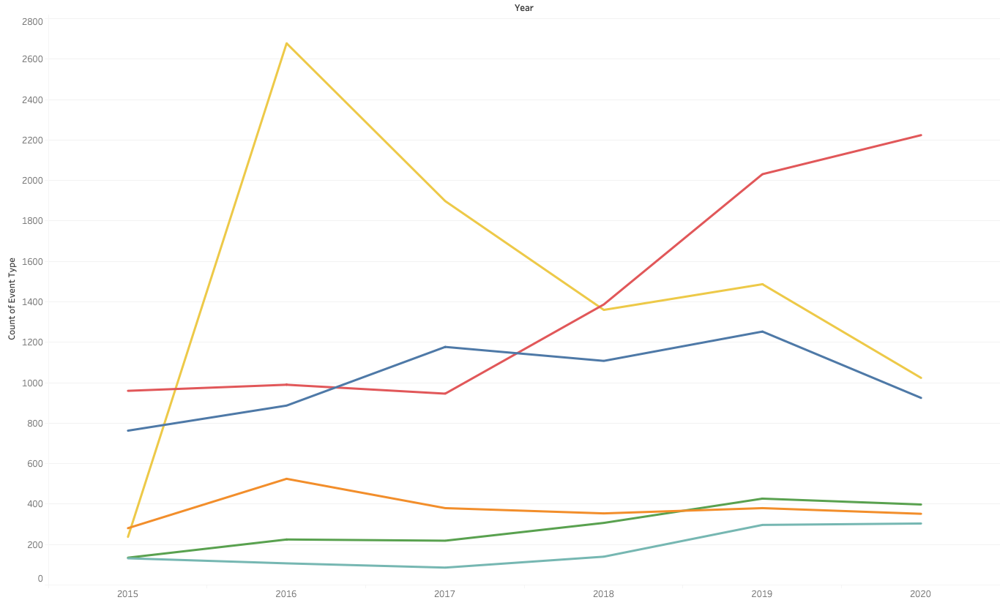{width=110%}
5.  Open another new worksheet *(to create a line graph showing count of fatalities by event type over years)*.
6.  Drag **Year** and **Fatalities** to Columns and Rows respectively and drag **Event Type** to **Color**. Final look: \
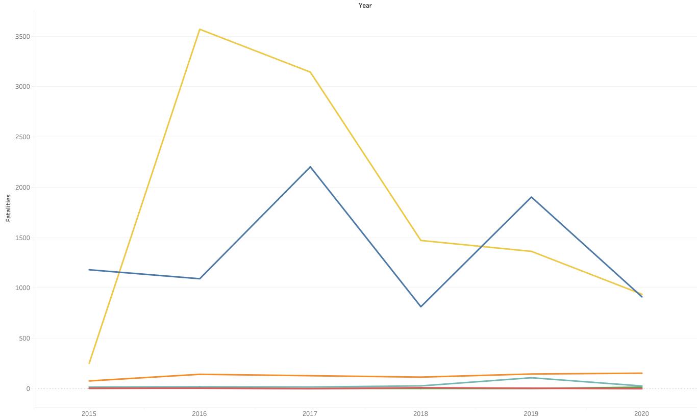{width=110%}
7.  Open another new worksheet *(to create a heat map showing frequency of conflicts between two parties over years)*.
8.  Drag **Year** and **Interaction** to Columns and Rows respectively, and change **Interaction** from **Measure(Count)** to **Dimension** (as shown in 4.2.1. step 14).
9.  Drag **Event Type** to **Color** and change it from **Dimension** to **Measure(Count)** (as shown in 4.2.1. step 14).
10.  Change the color palatte to Red (as shown in 4.2.1. step 6). Final look: \
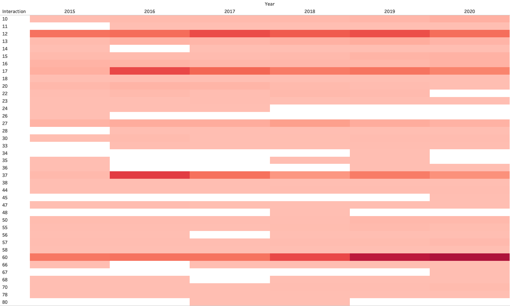{width=110%}

11.  Open a new dashboard.
12.  Change the size of dashboard to **Generic Desktop** (as shown in 4.2.1. step 19).
13.  Drag 1 heatmap and 2 line graphs into dashboard.
14.  Change representation of **Event Type** filter to **Single Value (Dropdown)** and representation of **Country** filter to **Single Value (List)** (as shown in 4.2.1. step 20).
15.  Apply all filters on 3 graphs, by adjusting **Applying to Worksheets** -> **Selected Worksheets** (as shown in 4.2.1. step 21).
16.  Edit title of 3 graphs (as shown in 4.2.1. step 22).
17.  Add a **Text Object** to dashboard, explaining the meaning of interaction code. \
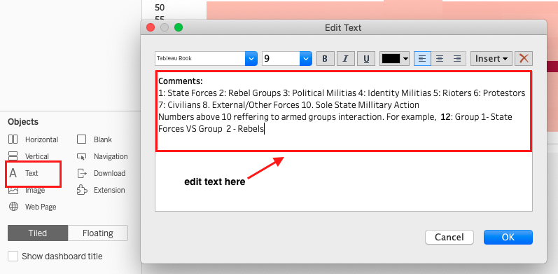
18.  Final look of **Temporal Analysis Dashboard**.
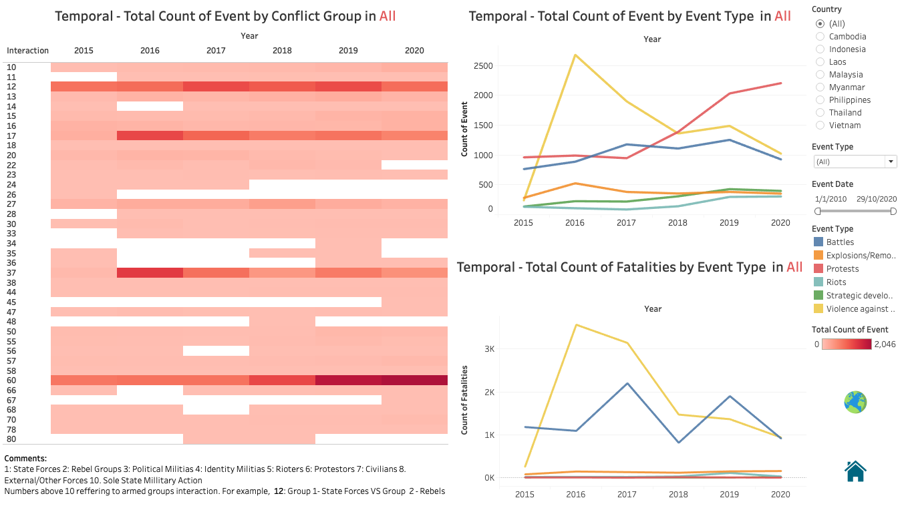{width=110%}

### 4.2.3 Main Dashboard
1.  Download images of earth and calendar online, create a custom folder under **My Tableau Repository** -> **Shapes** and put images inside.\
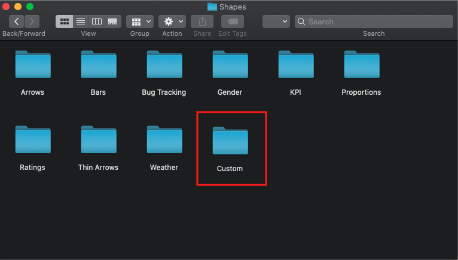
2.  Create a calculated field named **image**, with value 0.
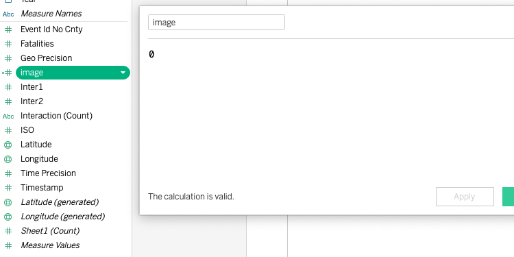
3.  Open a new worksheet *(to create a Button for Spatial Analysis Dashboard)*.
4.  Drag **image** to **Detail** and change graph representation from Automatic to **Shape** under **Marks** (as shown in 4.2.1. step 3).
5.  Change the default shape to the image of **earth**.

-  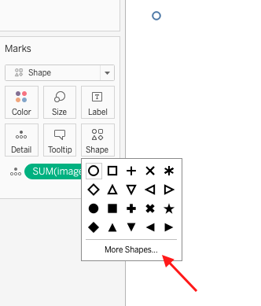
-  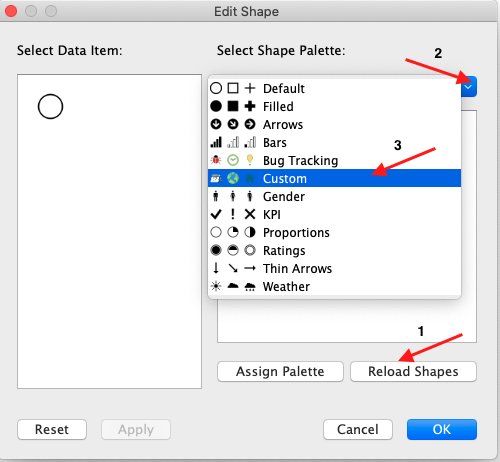
-  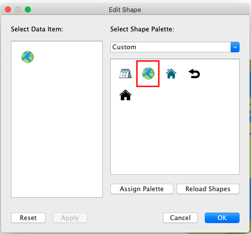
6.  Change the layout of the worksheet from Standard to **Entire View**.\
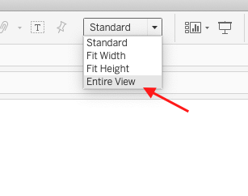
7.  Edit the content of **Tooltip** to "click to view the spatial analysis" 
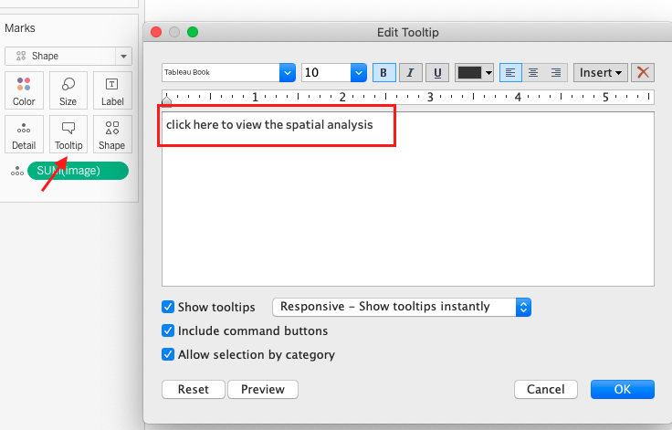
8.  Similarly, open a new worksheet *(to create a Button for Temporal Analysis Dashboard)* and a new worksheet *(to create a Button for Return to the Main Dashboard)*.
9.  Open a new dashboard and change the size of dashboard to **Generic Desktop** (as shown in 4.2.1. step 19).
10.  Drag 2 image worksheets into dashboard and add border.
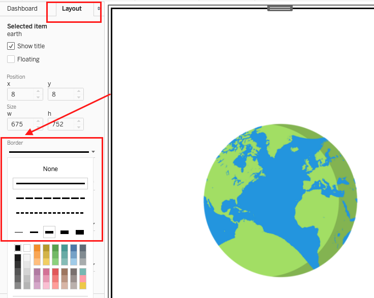
11.  Add a **Text Object** to dashboard (as shown in 4.2.2. step 17), giving a brief introduction of this data visualization.
12.  Add an **Image Object** to dashboard.

-  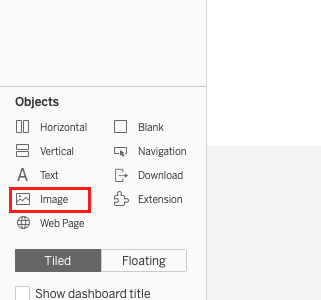
-  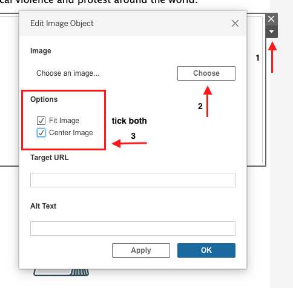
13.  Add 2 **Text Object** to dashboard as titles of spatial and temporal analysis dashboards, and change their background color.\
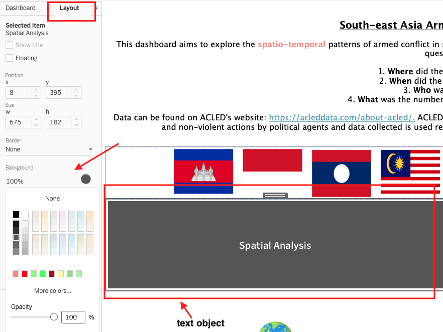
14.  Add interactivity on the **Earth** and **Calendar** worksheets.

-  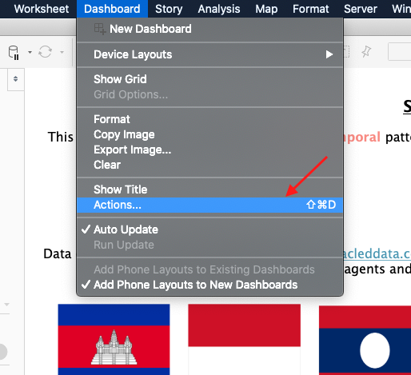
-  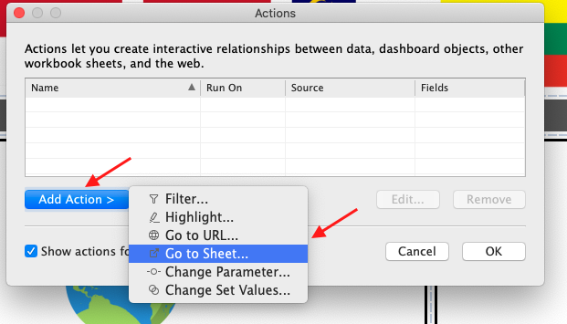
-  
-  
-  
15.  Final look of **Main Dashboard**:
{width=110%}
16.  Similarly, add interactive **Return Button** on **Spatial Analysis Dashboard** and **Temporal Analysis Dashboard**.\

-  
-  

## 5. Major Observations
1.  As we can see from the event density map, Shan province in Myanmar has the highest number of political conflicts between 2015-2020 and 63% of events in Shan are battles. By jumping to the Temporal Analysis Dashboard and select Shan, battles occurred most frequently in 2015, between state forces and rebel groups, resulting in more than 800 fatalities.\

-  
-  
-  
-  
2.  As we can see from the temporal heat map, the number of protests (1-sided protest) has been increasing over the years. By looking into spatial dashboard, the majority of protests took place in Jakarta. \

-  
-  {width=110%}
3.  Although the number of protests is relatively high compared to other type of events, fatalities of protests are generally low, whereas violence against civilians occurred frequently between 2015 - 2020 and its fatalities are also high, peaking at 3569 in 2016.

4.  Armed conflicts between rebel groups and protestors, political militias and identity militias, identity militias and rioters, identity militias and external forces, protestors and civilians are very rare.

5.  Philippine and Myanmar account for majority of the events occurring between 2015 and 2020, especially in battles and violence against civilian event types. In the events of riots, Indonesia makes up a larger proportion.\
-  
-  
-  
-  
-  
-  