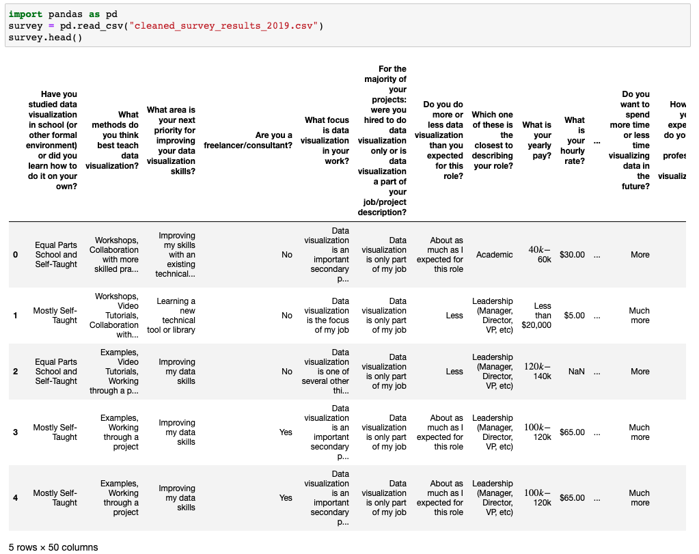
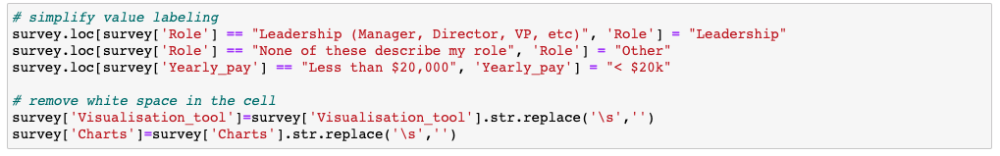
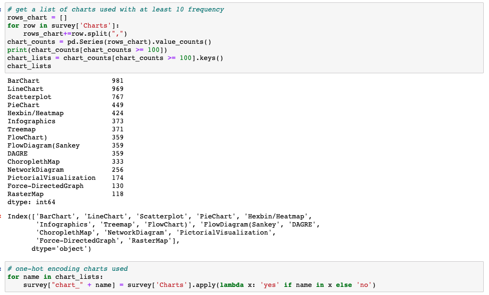

```{r setup, include=FALSE}
knitr::opts_chunk$set(echo = FALSE)
```

## 1. Overview
Data visualization is the graphical representation of information and data. It has been an important factor in data analytics and decision making process, as it can reveal insights that are often difficult to be delivered in other forms. Therefore,understanding the current state of data visualization is crucial. It gives organizations and practitioners in the field a comprehensive picture of where data visualization stands today. Also, it provides people who have an interest in data visualization with a better understanding of the field.

In this session, the focus is on cluster analysis. The aim is to explore patterns and similarities of people involving in the data visualisation field, using a survey that was conducted in 2019 with 1700 participants and has 50+ questions.

## 2. Data Wrangling
### 2.1 Install and load R packages
For this session, the **tidyverse**, **ggforce**, **GGally**, **plotly R** and **parcoords** packages will be used.

-  **tidyverse**: load the core tidyverse packages: 
    -  **ggplot2**: for data visualisation.
    -  **dplyr**: for data manipulation.
    -  **tidyr**: for data tidying.
    -  **readr**: for data import.
-  **ggforce**, **GGally**: extend data visualisation functionality to ggplot2
-  **plotly R**: for creating interactive web-based graphs
-  **parcoords**: for creating parallel coordinates plots

The code chunks below are used to install and load the packages in R.

```{r install package, messsage=FALSE, warning=FALSE, echo=TRUE}
packages = c('tidyverse', 'ggforce', 'GGally', 'plotly', 'parcoords', 'knitr')
for(p in packages){
  if(!require(p, character.only = T)){    
    install.packages(p)
  }
  library(p, character.only = T)
}
```

### 2.2 Data Preprocessing
-  Import dataset.

{width=110%}

-  Select columns/variables that are going to be used and investigated for this analysis, the following 10 questions are selected for exploration:
    -  Have you studied data visualization in school (or other formal environment) or did you learn how to do it on your own?
    -  Which one of these is the closest to describing your role?
    -  What is your yearly pay?
    -  What technologies do you use to visualize data? Select all that apply.
    -  Which of these charts have you used in production in the last 6 months? Select all that apply.
    -  The organization you work for is in which of the following areas?
    -  If you went to college, what did you major in during your undergraduate work?
    -  What\'s your gender identity?
    -  What country do you live in?'
-  Drop records with any missing value
-  Rename columns as names are too long

{width=110%}

-  Simplify label of values, for more concise visualisation later 
-  remove white space in each cell, to avoid duplicates in the later one-hot encoding. For example, if we have two answer records "Excel, Python" and "Python, Excel" for the survey question "What technologies do you use to visualize data?" and we split it by "," then we will have 4 different values "Excel", " Excel", "Python", " Python", whereas in fact, there are only two values.

{width=110%}

-  get a list of visualisation tools with at least 10 frequency in the survey

{width=110%}

-  one-hot encoding to indicate if different tools are used by survey respondents

{width=110%}

-  similarly, get a list of charts used with at least 10 frequency in the survey
-  one-hot encoding to indicate if different charts are used in production in the last 6 months by survey respondents

{width=110%}

-  remaining columns

{width=110%}

## 3. Visualisation exploration
```{r, echo=TRUE, eval=TRUE}
survey <- read_csv("data_visualization_survey-master/data/processed_survey.csv")
survey <- survey[,2:ncol(survey)]
survey
col_list <- colnames(survey)
col_list
```

