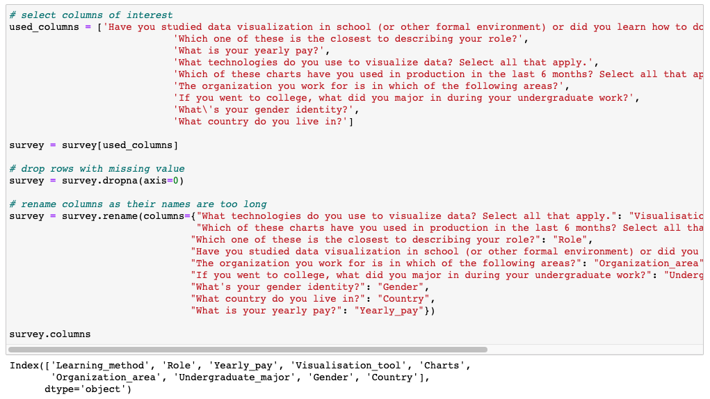

```{r setup, include=FALSE}
knitr::opts_chunk$set(echo = FALSE)
```

## 1. Overview
Data visualization is the graphical representation of information and data. It has been an important factor in data analytics and decision making process, as it can reveal insights that are often difficult to be delivered in other forms. Therefore,understanding the current state of data visualization is crucial. It gives organizations and practitioners in the field a comprehensive picture of where data visualization stands today. Also, it provides people who have an interest in data visualization with a better understanding of the field.

In this sub-modulo, the focus is on cluster analysis. The aim is to find appropriate visualisation for exploring patterns and similarities in respondents, using a survey that was conducted in 2019 with 1700 participants and has 50+ questions.

## 2. Data Wrangling
### 2.1 Install and load R packages
For this session, the **tidyverse**, **ggforce**, **GGally**, **plotly R** and **parcoords** packages will be used.

-  **tidyverse**: load the core tidyverse packages: 
    -  **ggplot2**: for data visualisation.
    -  **dplyr**: for data manipulation.
    -  **tidyr**: for data tidying.
    -  **readr**: for data import.
-  **ggforce**, **GGally**: extend data visualisation functionality to ggplot2
-  **plotly R**: for creating interactive web-based graphs
-  **parcoords**: for creating parallel coordinates plots

The code chunks below are used to install and load the packages in R.

```{r install package, messsage=FALSE, warning=FALSE, echo=TRUE}
packages = c('tidyverse', 'ggforce', 'GGally', 'plotly', 'parcoords', 'knitr')
for(p in packages){
  if(!require(p, character.only = T)){    
    install.packages(p)
  }
  library(p, character.only = T)
}
```

### 2.2 Data Preprocessing
-  Import dataset.

{width=110%}

-  Select columns/variables that are going to be used and investigated for this analysis, the following 10 questions are selected for exploration:
    -  Have you studied data visualization in school (or other formal environment) or did you learn how to do it on your own?
    -  Which one of these is the closest to describing your role?
    -  What is your yearly pay?
    -  What technologies do you use to visualize data? Select all that apply.
    -  Which of these charts have you used in production in the last 6 months? Select all that apply.
    -  The organization you work for is in which of the following areas?
    -  If you went to college, what did you major in during your undergraduate work?
    -  What\'s your gender identity?
    -  What country do you live in?'
-  Drop records with any missing value
-  Rename columns as names are too long

{width=110%}

-  Simplify label of values, for more concise visualisation later 
-  remove white space in each cell, to avoid duplicates in the later one-hot encoding. For example, if we have two answer records "Excel, Python" and "Python, Excel" for the survey question "What technologies do you use to visualize data?" and we split it by "," then we will have 4 different values "Excel", " Excel", "Python", " Python", whereas in fact, there are only two values.

{width=110%}

-  get a list of visualisation tools with at least 10 frequency in the survey

{width=110%}

-  one-hot encoding to indicate if different tools are used by survey respondents

{width=110%}

-  similarly, get a list of charts used with at least 10 frequency in the survey
-  one-hot encoding to indicate if different charts are used in production in the last 6 months by survey respondents

{width=110%}

-  example of one-hot encoding columns

{width=110%}

-  remaining columns

{width=110%}

## 3. Visualisation prototype
```{r, echo=TRUE, eval=TRUE}
# import processed dataset
survey <- read_csv("data_visualization_survey-master/data/processed_survey.csv")
survey <- survey[,2:ncol(survey)]
survey
# column information
col_list <- colnames(survey)
col_list
```

### 3.1 Parallel Sets 

Since this is a survey data, columns in the dataset all have categorical variables. It's not appropriate to use clustering techniques such as dendrogram and k-means clustering method. Therefore, Parallel Set chart, which is compatible with categorical data, is taken into considerations in this case. The width of polylines indicate the frequency of how often each category occur and the width of bar reflects the percentage of each response. The code below is an example of examining the relationship between the usage of different tools and role of respondents. 

Use **geom_parallel_sets**, **geom_parallel_sets_axes**, **geom_parallel_sets_labels** to plot the Parallel sets

```{r, echo=TRUE, eval=FALSE}
# group by all the tools 
selected_tool <- c(col_list[2], col_list[10:25])
tool <- survey %>% group_by(survey[selected_tool]) %>%
summarise(freq = n()) 

# gather the data.frame into long form
tool <- gather_set_data(tool, 1:17)

# plot parallel set, Role of respondents are used to fill 
ggplot(tool, aes(x, id = id, split = y, value = freq)) + 
geom_parallel_sets(aes(fill = `Role`), alpha = 0.3, axis.width = 0.2) +
geom_parallel_sets_axes(axis.width = 0.2) +
geom_parallel_sets_labels(colour = 'orangered1', angle=360, size = 3) +
theme(axis.text.x = element_text(face="bold", angle = 90, size=14))
```
{width=110%}

As we can see from the parallel chart, **Designer**, **Developer**, **Engineer**, **Leadership**, **Other** and **Scientist** show similar trend across the usage of tools 'ArcGIS', 'D3', 'Excel', 'ggplot2', 'Illustrator', 'Leaflet', 'Mapbox', 'Matplotlib', 'Pen&Paper', 'Plotly' and 'Python'. The result of **Analyst** category is quite distinctive, compared to other categories. Analyst respondents don't use majority of tools listed, except for Excel, R and Tableau. Besides, percentage of Academic respondents is relatively small, but their responses are very interesting. As shown in the chart, the majority of Academic respondents don't use any of the tool listed in the survey. Based on this parallel chart, we can roughly summarise the data into 3-4 groups.

Similarly, let's take a look of the relationship between different charts used in production in the last 6 months and role of respondents.

```{r, echo=TRUE, eval=FALSE}
# group by all the charts used
selected_chart <- c(col_list[2], col_list[26:40])
chart <- survey %>% group_by(survey[selected_chart]) %>%
summarise(freq = n())

# gather the data.frame into long form
chart <- gather_set_data(chart, 1:16)

# plot parallel set
ggplot(chart, aes(x, id = id, split = y, value = freq)) + 
geom_parallel_sets(aes(fill = `Role`), alpha = 0.3, axis.width = 0.2) +
geom_parallel_sets_axes(axis.width = 0.2) +
geom_parallel_sets_labels(colour = 'orangered1', angle=360, size = 3) +
theme(axis.text.x = element_text(face="bold", angle = 90, size=14))
```

{width=110%}

Again, **Designer**, **Developer**, **Engineer**, **Leadership**, **Other** and **Scientist** behave similarly with respect to the usage of charts. **Academic** respondents don't use majority of the charts, except for 
'Bar Chart', 'Line Chart' and "Scatter plot".

In general, parallel set charts are informative and useful in finding similarities and patterns of the data. We can incorporate it into our Shiny-based Visual Analytics Application (Shiny-VAA) and add interactivity. Role of respondents is used in the above two examples. For the final application, we can add a selection input, with options including role, yearly pay, educational background, area of organisation, gender and country.  

### 3.2 Coordinate Plot 

Use **ggparcoord** to plot the Coordinate plot

```{r, echo=TRUE, fig.height=10, fig.width=20}
ggparcoord(data = survey, 
           columns = c(1:3,6:9), 
           groupColumn = 13,
           scale = "uniminmax",
           showPoints = TRUE,
           boxplot = TRUE) +
  theme(axis.text.x = element_text(face="bold", angle = 90, size=14))
```
This coordinate plot can also be used to investigate the similarity between groups. However, one drawback is that values of each x variable can't be labeled on the plot, therefore, it's hard to summarise information into groups as you don't know who is who.

```{r, echo=TRUE, fig.height=10, fig.width=20}
ggparcoord(data = survey, 
           columns = c(10:25), 
           groupColumn = 2,
           scale = "uniminmax",
           showPoints = TRUE,
           boxplot = TRUE) +
  theme(axis.text.x = element_text(face="bold", angle = 90, size=10)) +
  facet_wrap(~ Role)
```

Use **parcoords** to plot an interactive parallel coordinates

```{r, echo=TRUE, fig.width=15}
parcoords(survey[,c(1:3)],
          rownames = FALSE,
          reorderable = T,
          brushMode = '1D-axes')
```

This plot gets very messy when a variable has multiple values.

## 4. Proposed storyboard for the sub-module.

As discussed in the previous sections, parallel set chart with interactivity is informative, clear and useful, therefore it will be used for this sub-modulo. 

{width=110%}